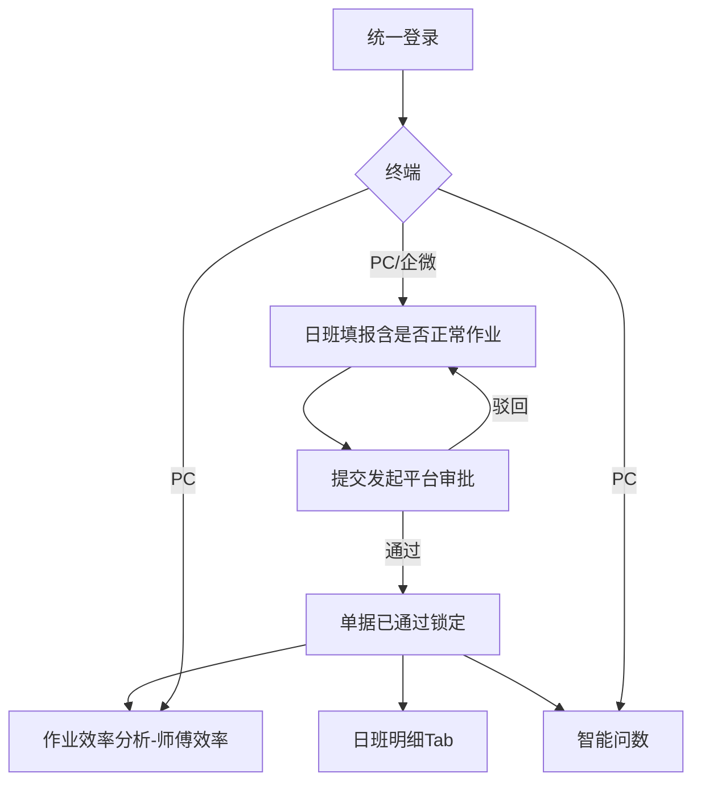
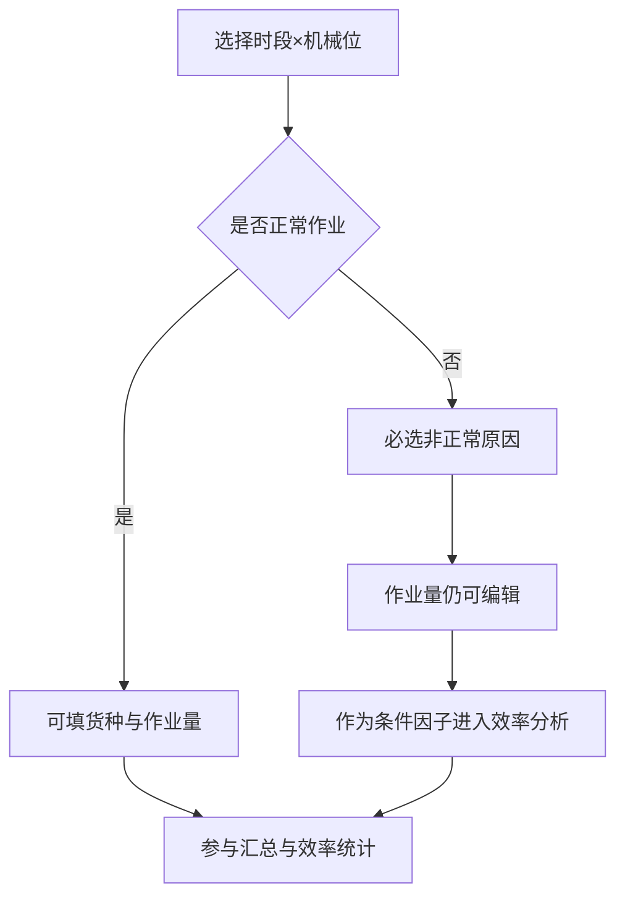
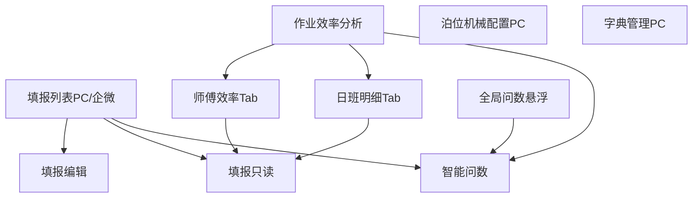
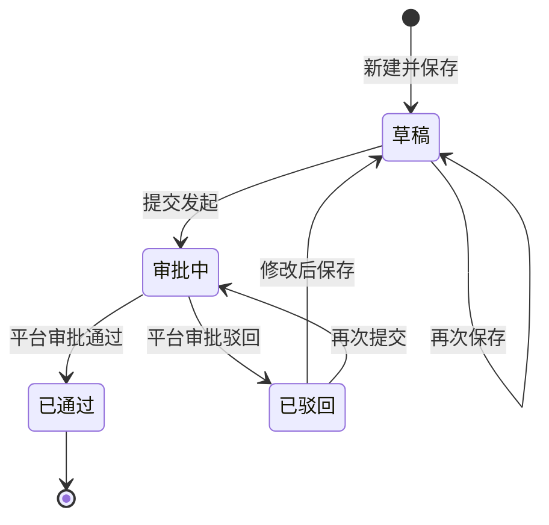
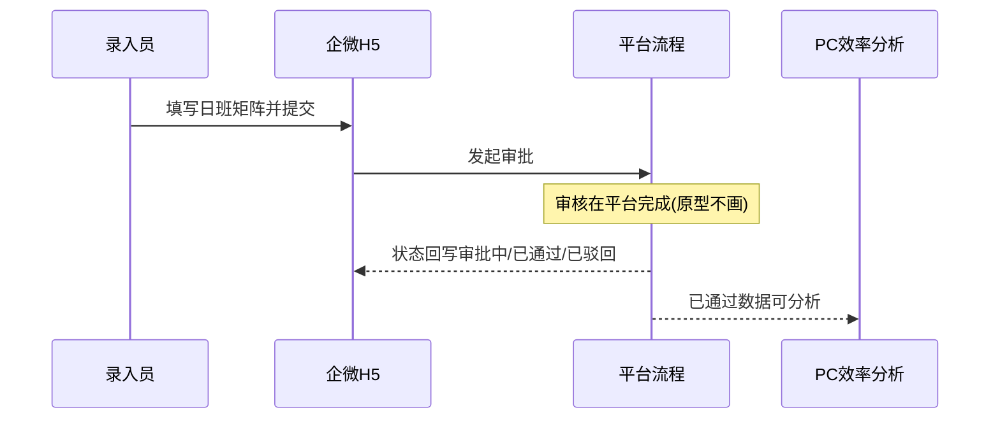
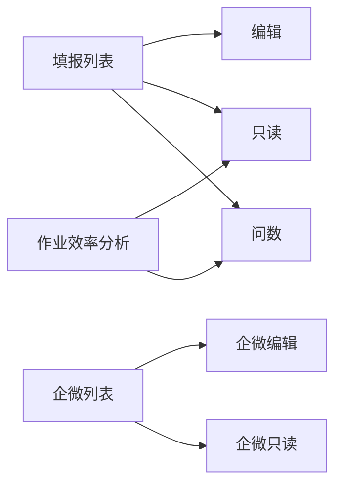

# 武港联投 · 每日每班单机作业量统计 — 产品需求文档（PRD）

| 项目 | 内容 |
|---|---|
| 版本号 | v1.0.0 |
| 版本更新日期 | 2026-08-03 |
| 版本迭代说明 | 在唯一工作版本内迭代：①填报增加「是否正常作业」及非正常原因（作业量仍可填，作为效率分析条件因子）；②「已通过数据速览」升级为「作业效率分析」，核心考核师傅在不同货种、白/夜班下的单位时间作业量；③本版纳入企微 H5（填报并发起流程；审核规则写入文档，原型不单独画审批页）。保留智能问数。未经准许不另建版本 |
| 终端形态 | PC 端 Web（TOS 子模块）+ 企业微信内嵌 H5（轻量填报发起） |
| 登录方式 | 统一登录（平台账号）；企微侧复用企微身份对接平台账号 |
| 需求来源 | 《每日每班时间作业统计表.xlsx》+ 效率分析/企微填报增强 |
| 上一版本 | —（唯一工作版本，功能在本版内持续迭代） |

---

## 目录

- [一、结论摘要](#一结论摘要)
- [二、产品概述](#二产品概述)
- [三、范围说明](#三范围说明)
- [四、业务流程](#四业务流程)
- [五、功能模块总览](#五功能模块总览)
- [六、字段与汇总规则](#六字段与汇总规则)
- [七、用户交互路径](#七用户交互路径)
- [八、页面清单与跳转](#八页面清单与跳转)
- [九、需求清单](#九需求清单)
- [十、数据可见范围说明](#十数据可见范围说明)
- [十一、场景说明](#十一场景说明)
- [十二、非功能性需求](#十二非功能性需求)
- [十三、风险项](#十三风险项)
- [十四、待确认](#十四待确认)

---

## 一、结论摘要

本版在录入闭环与智能问数基础上，补齐 **作业条件结构化（是否正常作业）**、将原速览升级为 **以师傅为核心的作业效率分析**，并纳入 **企微 H5 填报发起**（审核规则文档化，原型不画审批页）。

| 能力 | 结论 | 优先级 |
|---|---|---|
| 是否正常作业 | 时段×机械位必填；「否」必选原因（沿用现有备注原因字典）；作业量仍可编辑 | P0 |
| 非正常与效率 | 非正常不强制清零作业量；分析时作为「作业条件因子」对比正常/非正常下的吨/小时 | P0 |
| 作业效率分析 | 菜单更名；核心考核师傅；按货种、白班/夜班看单位时间作业量 | P0 |
| 日班明细 | 效率分析页内次级 Tab，保留按日班浏览已通过数据能力 | P1 |
| 智能问数 | 保留；可问师傅/货种/班次效率类问题（P1 扩展） | P0/P1 |
| 企微 H5 | 本版包含：填报、保存、提交发起；审核流程写入文档，原型不单独交付审批页 | P0 |
| 审批/消息/权限配置 | 平台承接；本模块原型不画审批中心/消息/权限页 | — |

### 已锁定业务约定

| 约定项 | 结论 |
|---|---|
| 版本策略 | 唯一 v1.0.0 内迭代 |
| 作业量单位 | 吨，保留 2 位小数 |
| 单机效率看板 | 不做；本期做 **师傅效率**（非机械台时效率看板） |
| 泊位–机械 | 固定绑定，每泊位 1～2 台机械 |
| 录入组织方式 | 一人填报全部泊位 |
| 录入粒度 | 按「开班日 + 班次」填满 12 时段 |
| 货种字段 | 全部机械位统一具备货种 |
| 夜班日期 | 归属开班日 |
| 师傅归并 | 按司机字典姓名汇总；一人多机明细带机械 |
| 原因字典 | 沿用现有：停电/无生产作业、吃饭休息、车辆断档、交接班、避高温暂停、下雨暂停、完船；本期不强制加「其他」 |
| 填报后 | 提交后走平台审批；通过后锁定；分析仅消费已通过 |
| 助手默认窗口 | 近 1 个月；超窗询问；本期不导出 |
| 单位时间 | 1 个填报时段格子 = 1 小时 |

---

## 二、产品概述

### 2.1 产品定位

港口现场 **单机分时段作业量记录、师傅作业效率分析与智能问数** 工具；PC 承担分析与配置，企微承担现场轻量填报与发起。

### 2.2 产品目标

| 目标 | 说明 | 优先级 |
|---|---|---|
| 结构化日班录入 | 含是否正常作业 + 原因 + 可编辑作业量 | P0 |
| 自动汇总 / 填后锁定 | 提交审批通过后锁定 | P0 |
| 作业效率分析 | 按师傅、货种、白/夜班的单位时间作业量考核 | P0 |
| 企微轻量填报发起 | 现场填报并提交发起流程 | P0 |
| 智能对话问数 | 自然语言查询已通过数据 | P0 |
| 快捷问数 | 预置日常汇总与效率类快捷 | P1 |
| 字典 / 导出填报 | 司机/货种/原因字典；列表导出 | P1 |

### 2.3 用户角色定义

| 角色 | 职责 | 终端侧重 |
|---|---|---|
| 作业录入员 | 填报、保存、提交发起 | PC + 企微 |
| 数据查看人 | 效率分析、问数、只读写填报 | PC 为主 |
| 基础配置员 | 泊位机械、字典 | 仅 PC |
| 审批人 | 平台审批通过/驳回 | 平台能力；文档描述，原型不画审批页 |

---

## 三、范围说明

### 3.1 包含（本版）

| 范围 | 优先级 | 说明 |
|---|---|---|
| 日班矩阵录入/汇总/列表/字典/导出 | P0/P1 | 继承并增强正常作业字段 |
| 作业效率分析（原已通过数据速览升级） | P0 | 师傅效率为主 |
| 日班明细 Tab | P1 | 效率分析页内保留原速览浏览能力 |
| 智能问数 + 快捷问数 | P0/P1 | 保留 |
| 企微 H5：列表/填报/提交发起 | P0 | 本版纳入 |
| 审批状态流转说明 | P0 | 仅文档；原型不画审批操作页 |

### 3.2 不包含（本期）

| 不包含项 | 说明 |
|---|---|
| 助手结果导出 | 本期只出结果 |
| 单机台时效率看板 | 不做 |
| 消息中心、权限配置页、审批操作原型页 | 平台统一；审核规则见文档 |
| 独立原生 App | 仅企微内嵌 H5 |

### 3.3 关于原「第 8 点」产品拍板说明

原方案曾问：效率分析是否保留「日班速览」能力。  
**拍板：** 菜单统一为「作业效率分析」；页内提供两个 Tab——**师傅效率（默认）** / **日班明细（次级）**，避免丢失按日班浏览已通过数据的能力。

---

## 四、业务流程

### 4.1 完整业务流程图

**文字解读：** 填报（含条件标记）→ 平台审批 → 已通过数据进入效率分析与问数；企微侧重填报发起，分析在 PC。

### 4.2 子流程：正常/非正常填报

**文字解读：** 非正常不等于停工清零；如大风/高温仍可作业但效率下降，需保留作业量，并在分析中与正常条件对比。

### 4.3 用户交互流程图

### 4.4 填报单状态机

**说明：** 效率分析与问数仅消费「已通过」。审批操作由平台承接，本版原型不交付审批页。

### 4.5 企微端数据流转（文档约定）

---

## 五、功能模块总览

### 5.1 作业填报（增强）

| 维度 | 说明 |
|---|---|
| 功能介绍 | 按开班日+班次录入各机械时段作业；标记是否正常作业及原因 |
| 前置条件 | 统一登录；泊位机械、司机/货种/原因字典已配置 |
| 数据权限 | 录入员编辑草稿/已驳回；他人按角色只读 |
| 页面跳转 | 列表→编辑/只读；提交后回列表看状态 |

矩阵单元格新增：

| 字段 | 规则 | 优先级 |
|---|---|---|
| 是否正常作业 | 必填；默认「是」 | P0 |
| 非正常原因 | 「否」时必填；选项=现有原因字典 | P0 |
| 作业量(吨) | 正常/非正常均可编辑；2 位小数 | P0 |
| 货种 / 司机 | 继承原规则 | P0 |

提交校验：存在「否」且无原因 → 拦截并高亮。

### 5.2～5.4 汇总 / 列表导出 / 基础配置

继承既有能力。字典中「备注原因」对外展示名可调整为「非正常原因」，枚举值不变。

### 5.5 作业效率分析（原已通过数据速览升级）

| 维度 | 说明 |
|---|---|
| 功能介绍 | 基于已通过数据，考核师傅在不同货种、白/夜班下的单位时间作业量，并解读作业条件因子 |
| 前置条件 | 存在已通过填报；统一登录 |
| 数据权限 | 同查看人；强制仅已通过 |
| 页面跳转 | 师傅行/日班行 → 只读写填报；「问数」唤起助手 |

#### 5.5.1 效率口径（产品补充，已锁定方向）

| 指标 | 定义 | 用途 | 优先级 |
|---|---|---|---|
| 单位时间 | 1 时段格子 = 1 小时 | 分母统一 | P0 |
| 时段产量 | 该时段该机械位作业量（吨） | 明细 | P0 |
| 吨/小时 | Σ作业量 ÷ Σ时段数 | **核心考核指标** | P0 |
| 师傅×货种×班次 | 按师傅，并可按货种、白/夜班切片 | 考核主视角 | P0 |

**分维统计（已锁定，最低交付）：** 正常、异常为 **两个并列统计维度**，不可混为一列敷衍。

| 统计维度 | 必出指标（吨/小时，除非另注） | 优先级 |
|---|---|---|
| 正常作业维度 | 平均、最大值、最小值；辅：时段数、总产量 | P0 |
| 异常作业维度（合计） | 平均、最大值、最小值；辅：时段数、总产量 | P0 |
| 异常·分原因维度 | 每一类非正常原因各自的平均、最大值、最小值；辅：时段数、总产量 | P0 |
| 切片条件 | 上述指标均需支持按师傅、货种、白班/夜班筛选或分组展示 | P0 |

**考核原则（产品补充）：**

1. **主考核对象是师傅**；一人多机按司机姓名归并，下钻可看机械。  
2. **主指标是吨/小时**，必须能按 **货种**、**白班/夜班** 切片。  
3. **正常 / 异常分维**：正常一套统计，异常一套统计；异常下再按原因拆分均值与极值，用于解释大风、高温等条件对效率的影响。  
4. 异常时段产量仍计入该维产量，**不因异常清空作业量**。  
5. 不做「单机台时看板」；跨货种不强制合成无业务含义的唯一总分。

#### 5.5.2 页面结构

| Tab/区域 | 内容 | 优先级 |
|---|---|---|
| 筛选条 | 开班日范围、班次、货种、泊位、机械、师傅、是否正常作业 | P0 |
| 总览卡片 | 总产量；正常维：均/最大/最小吨/小时；异常维：均/最大/最小吨/小时 | P0 |
| 异常原因明细表 | 各原因：平均、最大、最小吨/小时 + 时段数/产量 | P0 |
| Tab「师傅效率」 | 师傅列表；每行或展开区含正常维与异常维统计；支持货种/班次筛选 | P0 |
| Tab「日班明细」 | 按开班日+班次浏览已通过单据与汇总（承接原速览） | P1 |
| 空状态 | 无已通过数据提示 | P0 |

### 5.6 智能问数助手

继承既有能力；结果口径仅已通过。  
P1 扩展问法示例：某师傅近 7 日白班硫矿吨/小时；正常 vs 避高温条件下的效率对比。

入口：全局醒目悬浮「问数」、效率分析页内按钮；支持全屏。

### 5.7 快捷问数

保留原预置产量类快捷；新增效率类（P1）：

| 快捷名称 | 口径 | 优先级 |
|---|---|---|
| 今日各货种作业量合计 | 继承 | P0 |
| 今日师傅吨/小时榜 | 开班日=今日，按师傅吨/小时 | P1 |
| 今日白班 vs 夜班吨/小时 | 今日已通过，班次对比 | P1 |

用户自建/改名「我的快捷」规则不变（P0）。

### 5.8 企微 H5（本版纳入）

| 维度 | 说明 |
|---|---|
| 功能介绍 | 现场轻量填报作业数据并提交发起审批 |
| 前置条件 | 企微内打开；账号已绑定 |
| 数据权限 | 同录入员 |
| 页面跳转 | 列表→编辑→提交成功回列表 |

| 包含页面（原型交付） | 不包含（仅文档） |
|---|---|
| 填报列表、填报编辑（含正常作业字段）、只读详情 | 审批待办操作页、通过/驳回按钮页、消息中心、配置、效率分析、问数 |

---

## 六、字段与汇总规则

### 6.1 填报字段

| 层级 | 字段 | 规则 |
|---|---|---|
| 单头 | 开班日、班次（白/夜） | 必填；夜班归属开班日 |
| 明细 | 泊位、机械、司机、货种 | 机械随泊位带出；司机可选字典 |
| 明细 | 12 时段作业量 | 吨，2 位小数；正常/非正常均可填 |
| 明细 | 是否正常作业 | 是/否，默认是 |
| 明细 | 非正常原因 | 否时必填；字典枚举 |
| 汇总 | 班次小计、日合计 | 产量合计口径不变 |

### 6.2 效率结果展示字段

| 场景 | 列表示例 |
|---|---|
| 师傅总榜 | 师傅、时段数、总产量(吨)、综合吨/小时、正常吨/小时、非正常吨/小时 |
| 货种切片 | 师傅、货种、吨/小时、产量、时段数 |
| 班次切片 | 师傅、班次、吨/小时、产量、时段数 |
| 条件因子 | 原因、时段数、产量、吨/小时 |

### 6.3 问数结果字段

继承产量类；效率类增加吨/小时、班次、货种、是否正常作业等列。

---

## 七、用户交互路径

### 7.1 正常流程：PC 填报含条件标记

1. 打开填报编辑 → 各时段默认「正常作业」。  
2. 遇大风仍作业：选「否」→ 选原因（如避高温/下雨等现有项）→ 仍填写实际作业量。  
3. 提交发起 → 平台审批通过 → 进入效率分析。

### 7.2 正常流程：师傅效率分析

1. 侧栏进入「作业效率分析」。  
2. 默认 Tab「师傅效率」，筛选货种/班次。  
3. 查看总览与师傅榜；切换「仅正常条件」对比。  
4. 点击师傅下钻明细 → 只读写填报单。

### 7.3 正常流程：企微填报发起

1. 企微入口进入填报列表 → 新建/编辑日班。  
2. 填写矩阵（含是否正常作业）→ 提交发起。  
3. 列表查看审批中/已通过/已驳回状态（审核动作在平台，本原型不画）。

### 7.4 边界情况

| 边界 | 行为 |
|---|---|
| 非正常但作业量为 0 | 允许；分析计入非正常时段 |
| 非正常且作业量 > 0 | 允许；条件因子对比用 |
| 正常但作业量为 0 | 允许；不强制填原因 |
| 一人多机 | 榜单按司机汇总；明细分行显示机械 |
| 无已通过数据 | 效率分析空状态 |

### 7.5 异常兜底

| 异常 | 行为 |
|---|---|
| 「否」未选原因提交 | 拦截高亮 |
| 提交/加载失败 | 明确文案 + 可重试；草稿保留 |
| 问数超 1 个月 | 先询问再查 |
| 问数失败 | 可重试 + 推荐快捷 |

---

## 八、页面清单与跳转

> 不含消息中心、审批操作页、权限配置页。

### 8.1 PC

| 页面 | 路由建议 | 说明 | 优先级 |
|---|---|---|---|
| 作业填报列表 | /work-stat/list | 继承 | P0 |
| 作业填报编辑 | /work-stat/edit | 含是否正常作业 | P0 |
| 作业填报只读 | /work-stat/view | 展示条件与原因 | P0 |
| 作业效率分析 | /work-stat/efficiency | 原 approved-overview 升级 | P0 |
| 泊位机械配置 | /work-stat/berth-machine | 继承 | P1 |
| 字典管理 | /work-stat/dict | 继承 | P1 |
| 智能问数助手 | 抽屉组件 | 全局可唤起 | P0 |

### 8.2 企微 H5

| 页面 | 路由建议 | 说明 | 优先级 |
|---|---|---|---|
| 填报列表 | /m/work-stat/list | 轻量列表+状态 | P0 |
| 填报编辑 | /m/work-stat/edit | 矩阵+正常作业字段 | P0 |
| 填报只读 | /m/work-stat/view | 提交后/审批中查看 | P0 |

---

## 九、需求清单

| 功能点 | 优先级 | 前置依赖 | 操作流程 | 异常兜底 | 备注 |
|---|---|---|---|---|---|
| 是否正常作业字段 | P0 | 原因字典 | 选是/否→否则选原因→可填量 | 缺原因拦截 | 量可编辑 |
| 作业效率分析-师傅榜 | P0 | 已通过数据 | 筛选→看榜→下钻 | 空数据提示 | 吨/小时 |
| 按货种/班次切片 | P0 | 同上 | 切换维度列或筛选 | — | 核心考核 |
| 条件因子对比 | P0 | 正常作业字段 | 正常 vs 非正常吨/小时 | — | 解释变量 |
| 日班明细 Tab | P1 | 已通过 | 按日班浏览 | 空数据 | 承接原速览 |
| 企微填报发起 | P0 | 账号绑定 | 填→提交发起 | 失败可重试 | 本版纳入 |
| 审批流转说明 | P0 | 平台流程 | 文档约定状态机 | — | 原型不画审批页 |
| 智能问数/快捷 | P0/P1 | 已通过 | 同前 | 同前 | 保留 |
| 录入汇总字典导出 | P0/P1 | — | 同前 | 同前 | 继承 |

---

## 十、数据可见范围说明

| 角色 | 填报 | 效率分析 | 问数 | 企微填报 | 配置 |
|---|---|---|---|---|---|
| 作业录入员 | 编草稿/已驳回 | 是（已通过） | 是 | 是 | 否 |
| 数据查看人 | 只读 | 是 | 是 | 可选只读 | 否 |
| 基础配置员 | 可选 | 可选 | 可选 | 否 | 是 |
| 审批人 | 平台侧 | — | — | 平台审核 | — |

效率分析与问数 **一律不返回** 草稿/审批中/已驳回明细。

---

## 十一、场景说明

### 11.1 正常流程

- 录入员在企微或 PC 完成日班填报（含大风天非正常+实际产量）并提交；通过后，查看人在「作业效率分析」按师傅、货种、白夜班看吨/小时，并对比正常/非正常条件。

### 11.2 边界情况

- 全班非正常但仍有产量：总产量计入，条件因子区突出非正常吨/小时。  
- 仅白班有某货种：夜班切片对该货种显示空/无数据。  
- 日班明细 Tab 无数据：提示暂无已通过单据。

### 11.3 异常兜底

- 字典原因缺失：仅允许选现有枚举，不开放自由「其他」（本期）。  
- 服务异常：保存失败提示，不丢已输入草稿。

---

## 十二、非功能性需求

| 类别 | 要求 |
|---|---|
| 性能 | 近 1 个月师傅效率聚合 ≤ 3 秒（常规内网） |
| 安全 | 统一登录；企微身份对接平台账号 |
| 兼容性 | PC：Chrome/Edge 近两版；企微：企微内置浏览器 |
| 可用性 | 效率指标旁提供口径说明；矩阵默认「正常作业」降低填写成本 |
| 可扩展 | 后续可加导出、审批页；本版不做 |

---

## 十三、风险项

| 风险 | 影响 | 应对 | 优先级 |
|---|---|---|---|
| 综合吨/小时混入恶劣天气被误解为师傅能力差 | 考核争议 | 默认提供「仅正常条件」切换；条件因子区强制展示 | P0 |
| 货种切换导致作业难度不可比 | 横向不公 | 榜单强调同货种对比；跨货种分组不混排为唯一总分 | P0 |
| 企微矩阵填写负担 | 录入慢 | 默认正常；按时段/机械折叠；与 PC 字段一致 | P1 |
| 审批仅文档无原型 | 评审时缺界面 | 状态机与角色写清；确认不画审批页 | P1 |

---

## 十四、待确认

1. 问数时间跨度硬上限（建议最长 12 个月）是否采纳。  
2. 「今日」是否严格=开班日今日（含今日夜班）——当前按开班日口径。  
3. 我的快捷是否允许删除（本期原型先支持创建与改名）。  
4. 非正常原因 Top 分布图是否另做图表（表格已为 P0；图表建议 P1）。  
5. 极值（最大/最小）是否同时展示对应开班日+班次+时段，便于追溯（建议 P1 下钻）。

---

## 附录：本版能力包摘要

| 类型 | 内容 |
|---|---|
| 录入 | 日班矩阵 + 是否正常作业 + 原因；产量可填 |
| 分析 | 作业效率分析（师傅×货种×班次×吨/小时 + 条件因子）；日班明细 Tab |
| 问数 | 智能问数（醒目入口/全屏）+ 快捷 |
| 企微 | 填报列表/编辑/只读 + 提交发起（审批页不原型） |
| 版本 | 唯一 v1.0.0 |
