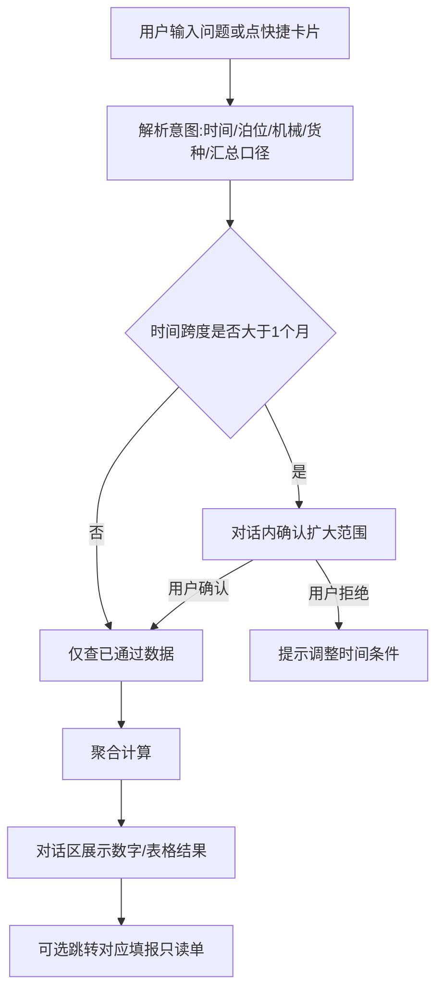
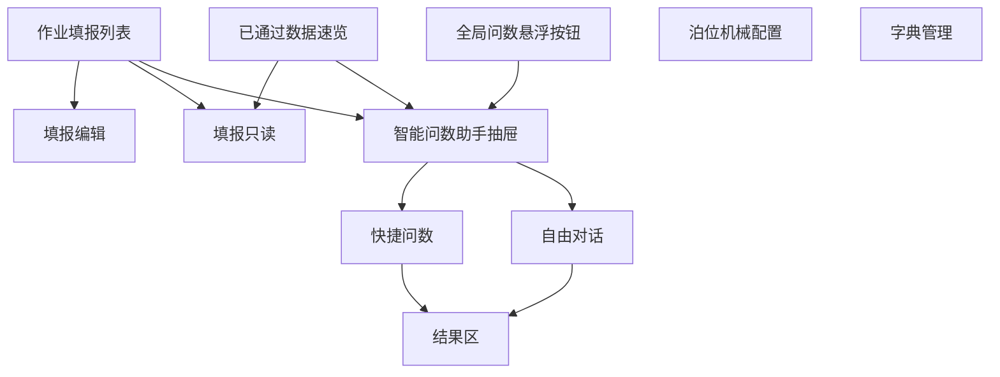
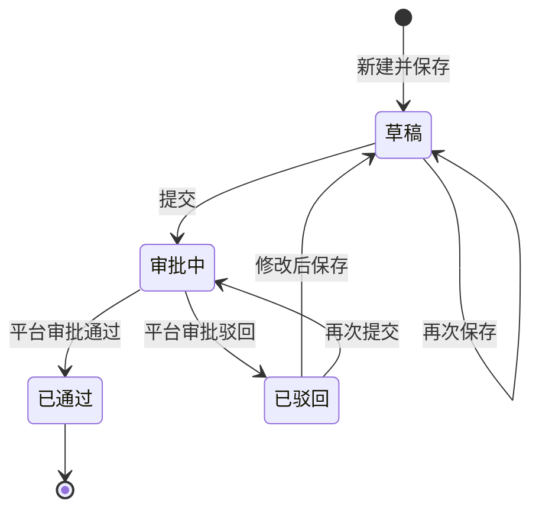
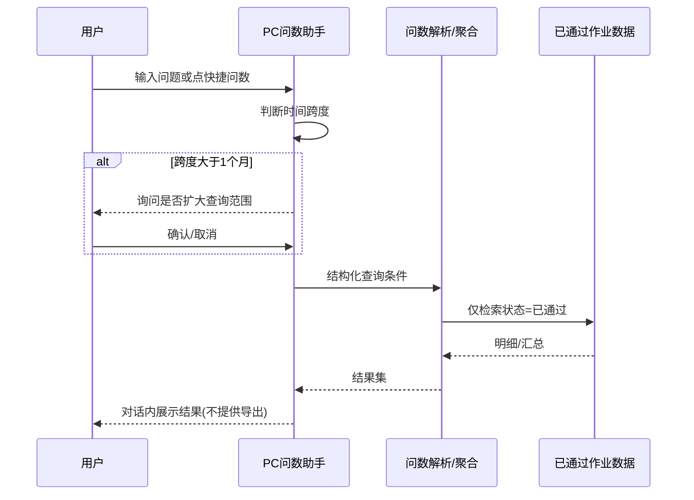
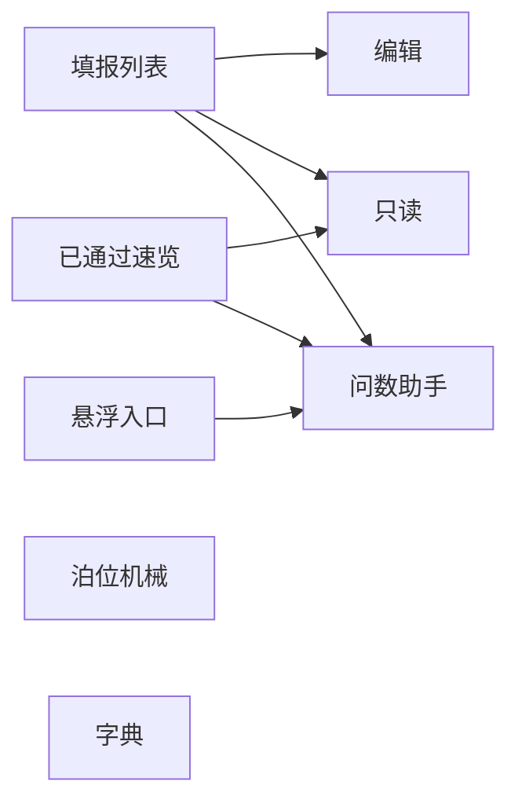

# 武港联投 · 每日每班单机作业量统计 — 产品需求文档（PRD）

| 项目 | 内容 |
|---|---|
| 版本号 | v1.0.0 |
| 版本更新日期 | 2026-07-29 |
| 版本迭代说明 | 首版完整能力：日班录入与汇总、已通过数据速览、智能问数助手（对话查询）、系统预置快捷问数、用户自建/改名快捷问数。助手默认近 1 个月「已通过」数据，超期先询问；本期助手只返回结果、不提供导出。本产品仅维护唯一版本号 v1.0.0，未经准许不另建版本 |
| 终端形态 | PC 端 Web（TOS 子模块） |
| 登录方式 | 统一登录（平台账号） |
| 需求来源 | 《每日每班时间作业统计表.xlsx》+ 速览/智能问数增强需求 |
| 上一版本 | —（唯一工作版本，功能在本版内持续迭代） |

---

## 目录

- [一、结论摘要](#一结论摘要)
- [二、产品概述](#二产品概述)
- [三、范围说明](#三范围说明)
- [四、业务流程](#四业务流程)
- [五、功能模块总览](#五功能模块总览)
- [六、字段与汇总规则](#六字段与汇总规则)
- [七、用户交互路径](#七用户交互路径)
- [八、页面清单与跳转](#八页面清单与跳转)
- [九、需求清单](#九需求清单)
- [十、数据可见范围说明](#十数据可见范围说明)
- [十一、场景说明](#十一场景说明)
- [十二、非功能性需求](#十二非功能性需求)
- [十三、风险项](#十三风险项)
- [十四、待确认](#十四待确认)

---

## 一、结论摘要

在 v1.0.0「日班录入 + 汇总 + 查询导出」基础上，本版补齐 **已通过数据的快速浏览视角**，并增加 **智能问数助手**：用户可通过自然语言或预置快捷问法，快速获取日常汇总结果（如今日各货种作业量合计）。

| 能力 | 结论 |
|---|---|
| 数据速览 | 默认仅展示状态=已通过的填报数据 |
| 问数数据范围 | 默认近 1 个自然月；超过则先询问用户是否扩大范围 |
| 问数结果 | 本期仅对话内展示结果（表格/数字），不做导出 |
| 快捷问数 | 系统预置常用汇总问法，可在助手对话框一键触发；支持收藏 |
| 审批/消息/权限配置 | 仍由平台承接，本模块不设计对应页面 |

### 已锁定业务约定（含 v1.0.0）

| 约定项 | 结论 |
|---|---|
| 作业量单位 | 吨，保留 2 位小数 |
| 单机效率 | 本期不做 |
| 泊位–机械 | 固定绑定，每泊位 1～2 台机械 |
| 录入组织方式 | 一人填报全部泊位 |
| 录入粒度 | 按「开班日 + 班次」一次填满 12 时段 |
| 货种字段 | 全部机械位统一具备货种 |
| 夜班日期 | 归属开班日 |
| 填报后 | 提交后走平台审批；通过后锁定 |
| 速览数据 | 仅已通过 |
| 助手默认窗口 | 近 1 个月；超窗询问 |
| 助手导出 | 本期不做 |

---

## 二、产品概述

### 2.1 产品定位

港口现场 **单机分时段作业量记录、已通过数据速览与智能问数** 工具，作为 TOS 子模块。

### 2.2 产品目标

| 目标 | 说明 | 优先级 |
|---|---|---|
| 结构化日班录入 | 同 v1.0.0 | P0 |
| 自动汇总 / 填后锁定 | 同 v1.0.0 | P0 |
| 已通过数据速览 | 按日快速浏览审核通过数据与汇总 | P0 |
| 智能对话问数 | 自然语言查询已通过作业数据 | P0 |
| 快捷问数 | 预置日常汇总，对话框一键取数 | P1 |
| 字典 / 导出填报 | 同 v1.0.0 | P1 |

### 2.3 用户角色定义

| 角色 | 职责 | 说明 |
|---|---|---|
| 作业录入员 | 填报、提交；可使用速览与助手 | — |
| 数据查看人 | 速览、助手问数、列表只读 | 主用户之一 |
| 基础配置员 | 泊位机械、字典 | — |
| 审批人 | 平台审批 | 不设计审批页 |

---

## 三、范围说明

### 3.1 包含（v1.0.0 相对增量 + 继承）

| 范围 | 优先级 | 版本 |
|---|---|---|
| v1.0.0 全部录入/汇总/列表/字典/导出能力 | P0/P1 | 继承 |
| 已通过数据速览页 | P0 | 新增 |
| 智能问数助手（全局悬浮入口 + 速览页唤起） | P0 | 新增 |
| 快捷问数预置卡片与收藏 | P1 | 新增 |
| 超 1 个月查询范围二次确认 | P0 | 新增 |

### 3.2 不包含（本期）

| 不包含项 | 说明 |
|---|---|
| 助手结果导出 / 生成报表文件 | 明确本期只出结果 |
| 单机效率看板 | 不做 |
| 消息中心、审批页、角色权限配置页 | 平台统一 |
| 移动端 / 企微 H5 | 本版仍以 PC 为主，待确认表单选择 |

---

## 四、业务流程

### 4.1 完整业务流程图（含速览与问数）

```mermaid
flowchart TD
    A[统一登录进入模块] --> B{用户意图}
    B -->|填报| C[日班填报编辑/提交]
    C --> D[平台审批]
    D -->|通过| E[单据已通过锁定]
    B -->|速览| F[已通过数据速览]
    E --> F
    B -->|问数| G[打开智能问数助手]
    F --> G
    G --> H{查询跨度}
    H -->|≤1个月| I[检索已通过数据并返回答案]
    H -->|超过1个月| J[询问用户是否扩大范围]
    J -->|确认| I
    J -->|取消| K[缩小范围或结束]
    G --> L[点击快捷问数]
    L --> I
```

**文字解读：** 填报审批通过后进入可速览与可问数数据池；助手默认查近 1 个月，超期先问再查；快捷问数与自由对话共用同一查询引擎。

### 4.2 子业务流程：智能问数



**文字解读：** 问数只读已通过数据；结果留在对话框；可链到原单，但不提供导出按钮。

### 4.3 用户交互流程图



### 4.4 业务状态机（填报单，同 v1.0.0）



**说明：** 速览与助手 **仅消费「已通过」** 状态数据。

### 4.5 系统数据流转时序图（问数）



---

## 五、功能模块总览

### 5.1～5.4 作业填报 / 汇总 / 查询导出 / 基础配置

能力与 v1.0.0 保持一致（日班矩阵录入、自动汇总、列表筛选导出、泊位机械绑定、司机货种备注字典）。此处不重复展开字段细节，以 v1.0.0 为准并全部继承。

### 5.5 已通过数据速览（新增）

| 维度 | 说明 |
|---|---|
| 功能介绍 | 为查看人提供「每日填写且审核通过」数据的快速浏览与汇总视角 |
| 前置条件 | 存在状态=已通过的填报单；统一登录 |
| 数据权限 | 同数据查看范围；强制过滤非已通过数据 |
| 页面跳转 | 点击某日班 → 填报只读页；「问数」→ 打开助手并带入当前日期上下文 |

页面要素：

| 区域 | 内容 |
|---|---|
| 筛选 | 开班日（默认今日或近 7 日）、班次、泊位、机械、货种 |
| 汇总卡片 | 当日/筛选范围内总作业量、分泊位合计、分货种合计 |
| 明细区 | 按开班日+班次列表或矩阵缩略；全部只读 |
| 空状态 | 该范围无已通过数据时提示 |

### 5.6 智能问数助手（新增）

| 维度 | 说明 |
|---|---|
| 功能介绍 | 通过对话快速查询已通过作业数据，返回答案 |
| 前置条件 | 统一登录；有问数权限 |
| 数据权限 | 仅已通过；可见范围与查看人一致 |
| 页面跳转 | 全局悬浮按钮 / 速览页按钮 → 右侧抽屉；结果中「查看原单」→ 只读页 |

入口：

| 入口 | 说明 |
|---|---|
| 全局悬浮按钮 | 模块内任意业务页右下角；图标与文案须醒目（含「问数」文字标签），避免弱化为小圆点 |
| 助手全屏 | 抽屉支持一键切换全屏，便于阅读长表格结果 |
| 速览页内 | 「智能问数」按钮，可带入当前筛选日期 |

对话能力：

| 能力 | 规则 |
|---|---|
| 自由提问 | 支持时间、班次、泊位、机械、货种、备注原因等条件组合 |
| 默认时间窗 | 近 1 个自然月（相对「今天」） |
| 超窗处理 | 对话内明确询问：「查询范围超过 1 个月，是否继续？」确认后执行 |
| 数据口径 | 仅统计已通过单据 |
| 结果形态 | 关键数字 + 明细/汇总表；本期不提供导出 |
| 无法理解 | 提示可换说法，并推荐快捷问数 |

### 5.7 快捷问数（新增）

| 维度 | 说明 |
|---|---|
| 功能介绍 | 将日常高频汇总固化为快捷卡片，在助手对话框一键取数 |
| 前置条件 | 助手已打开 |
| 数据权限 | 同助手 |
| 页面跳转 | 点击卡片 → 自动发送对应问法并出结果 |

#### 系统预置快捷问数（首批）

| 快捷名称 | 问法口径 | 优先级 |
|---|---|---|
| 今日全港总作业量 | 开班日=今日，已通过，全泊位作业量合计（吨） | P0 |
| 今日各货种作业量合计 | 开班日=今日，按货种汇总作业量 | P0 |
| 今日各泊位作业量合计 | 开班日=今日，按泊位汇总 | P0 |
| 昨日全港总作业量 | 开班日=昨日，全港合计 | P0 |
| 本班（白/夜）作业量 | 用户选择或默认当前班次，今日该班合计 | P1 |
| 近7日货种作业量 | 近 7 个开班日，按货种汇总（未超 1 个月） | P1 |
| 今日停工备注分布 | 今日作业量=0 且有备注的原因次数 Top | P1 |
| 指定机械今日作业量 | 需用户补全机械名，或点选后再查 | P1 |

用户快捷能力（P0）：
- **创建快捷**：在助手内可将当前问法保存为我的快捷，须填写名称；
- **修改名称**：对我的快捷支持重命名；
- **使用**：点击我的快捷一键取数；
- 系统预置快捷与「我的快捷」分区展示，预置项不可改名，我的快捷可改名。

---

## 六、字段与汇总规则

### 6.1 填报字段（继承 v1.0.0）

填报单头、时段×机械明细、班次小计/日合计/总作业量口径不变；单位吨、2 位小数。

### 6.2 问数结果展示字段（新增）

| 场景 | 结果列（示例） |
|---|---|
| 总量类 | 时间范围、总作业量(吨)、单据数 |
| 货种汇总 | 货种、作业量(吨)、占比 |
| 泊位/机械汇总 | 泊位、机械、作业量(吨) |
| 备注分布 | 备注原因、出现次数 |

---

## 七、用户交互路径

### 7.1 速览已通过数据

1. 侧栏进入「已通过数据速览」。
2. 选择开班日/班次等条件 → 查看汇总卡片与明细。
3. 点击某日班 → 只读填报页。

### 7.2 快捷问数取「今日各货种合计」

1. 点击全局「问数」悬浮按钮。
2. 在快捷区点击「今日各货种作业量合计」。
3. 助手返回货种×作业量表格与合计数字。

### 7.3 超 1 个月自由问数

1. 用户输入「查近三个月硫矿作业量」。
2. 助手提示超过默认 1 个月，询问是否继续。
3. 确认后返回结果；取消则引导缩小时间范围。

### 7.4 异常分支

| 分支 | 行为 |
|---|---|
| 无已通过数据 | 结果区提示暂无数据 |
| 意图不清 | 提示换说法并展示快捷问数 |
| 查询超时/失败 | 报错提示，可重试 |
| 无权限 | 提示无问数权限（平台授权） |

---

## 八、页面清单与跳转

> 不含消息中心、审批操作页、权限配置页。

| 页面 | 路由建议 | 说明 | 优先级 |
|---|---|---|---|
| 作业填报列表 | /work-stat/list | 继承 | P0 |
| 作业填报编辑 | /work-stat/edit | 继承 | P0 |
| 作业填报只读 | /work-stat/view | 继承 | P0 |
| 泊位机械配置 | /work-stat/berth-machine | 继承 | P1 |
| 字典管理 | /work-stat/dict | 继承 | P1 |
| 已通过数据速览 | /work-stat/approved-overview | 新增 | P0 |
| 智能问数助手 | 抽屉组件 /work-stat/assistant | 全局可唤起，非独立审批类页面 | P0 |



---

## 九、需求清单

| 功能点 | 优先级 | 前置依赖 | 操作流程 | 异常兜底 | 备注 |
|---|---|---|---|---|---|
| 已通过数据速览 | P0 | 已通过单据 | 筛选→看汇总/明细→进只读 | 空数据提示 | 强制已通过 |
| 智能问数对话 | P0 | 已通过数据 | 提问→(超窗确认)→出结果 | 失败可重试 | 不导出 |
| 默认1个月窗口 | P0 | — | 超窗询问 | 用户取消则中止 | — |
| 快捷问数预置 | P0/P1 | 助手 | 一键触发问法 | 无数据提示 | 含今日各货种合计 |
| 创建我的快捷 | P0 | 成功问数或手输问法 | 保存并命名→我的快捷 | 名称为空拦截；重名提示 | — |
| 修改快捷名称 | P0 | 已有我的快捷 | 改名并保存 | 名称为空拦截 | 预置快捷不可改名 |
| v1.0.0 录入闭环 | P0 | — | 同前版 | 同前版 | 继承 |

---

## 十、数据可见范围说明

| 角色 | 填报 | 速览 | 问数助手 | 配置 |
|---|---|---|---|---|
| 作业录入员 | 可编辑草稿/已驳回 | 是（已通过） | 是 | 否 |
| 数据查看人 | 只读 | 是 | 是 | 否 |
| 基础配置员 | 可选 | 可选 | 可选 | 是 |

速览与助手 **一律不返回** 草稿/审批中/已驳回明细。

---

## 十一、场景说明

### 11.1 正常流程

- 查看人打开速览看今日已通过汇总；用助手点「今日各货种作业量合计」立即得到分货种吨数。

### 11.2 边界情况

- 今日尚无已通过单据：速览与快捷问数均提示暂无数据。
- 问「近 45 天」：先询问再查。
- 快捷「本班」但未指定班次：助手追问白班或夜班。

### 11.3 异常兜底

- 解析失败：推荐快捷问数。
- 服务异常：明确失败文案 + 重试。
- 跳转原单已不存在：提示单据不可用。

---

## 十二、非功能性需求

| 类别 | 要求 |
|---|---|
| 性能 | 1 个月窗口内常用汇总问数结果 ≤ 3 秒（常规内网）；超窗查询可接受更长并出进度提示 |
| 安全 | 统一登录；问数审计留存提问与条件（不含平台消息模块） |
| 兼容性 | Chrome / Edge 近两个大版本 |
| 可用性 | 快捷区置顶；超窗确认文案清晰 |
| 可扩展 | 预置问数可配置扩展；后续可加导出（本版不做） |

---

## 十三、风险项

| 风险 | 影响 | 应对 |
|---|---|---|
| 自然语言歧义 | 答非所问 | 快捷问数兜底 + 追问澄清 |
| 「今日」与开班日/夜班理解不一致 | 口径争议 | 结果区注明开班日口径 |
| 超大范围查询 | 性能压力 | 强制二次确认 + 上限【待确认】 |
| 用户期望导出 | 与本期范围冲突 | 界面不出现导出，文档已声明 |

---

## 十四、待确认

1. 问数时间跨度硬上限（建议最长 12 个月，超过直接拒绝）是否采纳。
2. 「今日」是否严格=开班日今日（含今日夜班），已按开班日口径设计，若需按自然小时切日请明示。
3. 收藏快捷是否允许重命名、排序。
4. 我的快捷是否允许删除（本期原型先支持创建与改名）。
5. 助手全屏时是否仍保留左侧业务页可见（默认全屏覆盖）。

---

## 附录：本版能力包摘要

| 类型 | 内容 |
|---|---|
| 录入 | 日班矩阵填报、汇总、提交锁定 |
| 速览 | 已通过数据速览 |
| 问数 | 智能问数助手（醒目入口 + 全屏） |
| 快捷 | 系统预置 + 用户创建/改名我的快捷 |
| 规则 | 默认近1个月，超期询问；只出结果不导出 |
| 版本 | 唯一 v1.0.0，未经准许不另建版本 |
