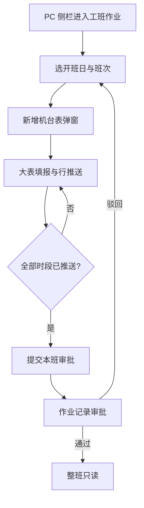
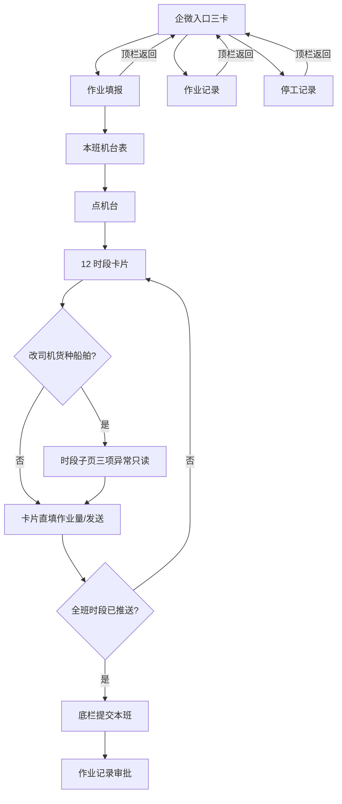
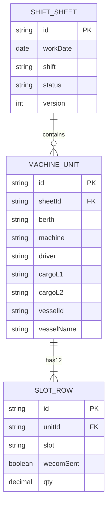
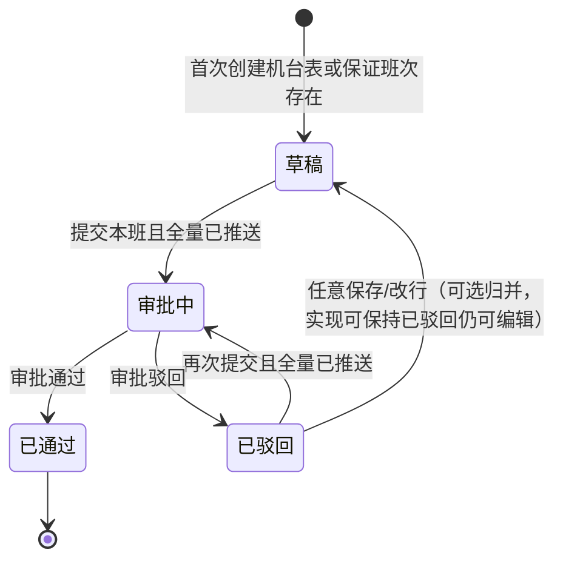
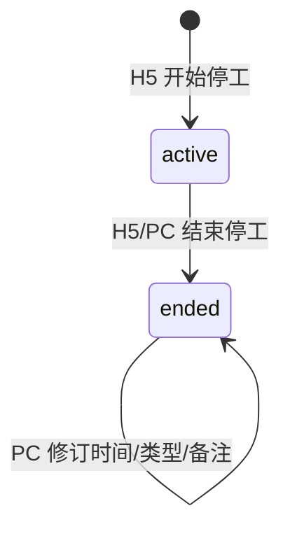

# 武港联投 · 单机作业量统计 — v1.1.0 产品需求文档（PRD）

| 项目 | 内容 |
|---|---|
| 版本号 | v1.1.0 |
| 版本更新日期 | 2026-10-08 |
| 版本定位 | 本版交付 **企微 H5 + 本版 PC**（工班 / 作业记录 / 停工 / **船舶调度**）；与 v1.0.0 共用工班与调度停工数据 |
| 终端形态 | PC 浏览器；企业微信内嵌 H5（原型带手机框预览） |
| 登录方式 | 统一平台登录 / 企微身份对接（原型不画登录页） |
| 关联版本 | 效率分析、船舶档案/船期、调度大屏、系统配置、企微推送配置见 [v1.0.0 PRD](../v1.0.0/prd.md) |
| 本版关键变更 | 开班日 **8 天**；小时推送后可改、提交前须全推；**停工以船舶调度为唯一数据源**（H5 反写）；**是否正常/原因/时长双端填报均只读**；H5 入口仅三页；本版侧栏含船舶调度 |
| 研发可读性 | **第四～六章**分 PC / H5 前端规格；**第七～十一章**为后端共用规格（实体/状态机/接口/权限/验收） |

---

## 目录

- [一、结论摘要](#一结论摘要)
- [二、范围说明](#二范围说明)
- [三、核心业务规则](#三核心业务规则)
- [四、双端对照总览](#四双端对照总览)
- [五、PC 端规格](#五pc-端规格)
- [六、H5 端规格（企微）](#六h5-端规格企微)
- [七、数据实体与字段](#七数据实体与字段)
- [八、状态机与推送规则](#八状态机与推送规则)
- [九、接口规格](#九接口规格)
- [十、权限矩阵](#十权限矩阵)
- [十一、验收标准](#十一验收标准)
- [十二、场景说明](#十二场景说明)
- [十三、风险项](#十三风险项)
- [十四、待确认](#十四待确认)

---

## 一、结论摘要

v1.1.0 聚焦现场可闭环的 **工班填报 → 行级企微推送 → 本班审批 → 停工（调度同源）**。**PC 与 H5 分端交付、共用数据**：PC 用大表，H5 用时段卡片；开班日 **8 天**；推送后可改，**提交前须全量已推送**；停工以 **船舶调度停工段** 为准。企微入口仅 **作业填报 / 作业记录 / 停工记录**。

| 能力 | 结论 | 优先级 |
|---|---|---|
| 开班日范围 | **今天往前共 8 天**（含今天；区间 `[今天-7日, 今天]`）；默认当天；创建机台表/列表筛选同口径 | P0 |
| 本版 PC 工班 | 开班日+班次下多张机台大表；必选船舶；行级编辑/推送/本班提交 | P0 |
| 企微 H5 填报 | 入口先进 **本班机台表**；再进 **12 张时段卡片**（禁止大表）；编辑子页；行级推送；本班提交；顶栏返回 **H5 总入口** | P0 |
| 小时推送 | 推送后**可改**；修改后须**再推送**；提交前 **12 时段（含 0 吨）均须已推送** | P0 |
| 小时异常字段 | **是否正常 / 非正常原因 / 非正常时长**：PC 大表与行弹窗、H5 卡片与时段子页 **均只读回显、不可改** | P0 |
| 作业记录 | PC 列表 + 企微卡片；审批中通过/驳回；草稿/驳回卡片可「继续填报」；H5 **无**右上角「去填报」 | P0 |
| 停工 | **调度为唯一数据源**；H5 开始/结束反写调度（登记页 **不挂入口**）；PC 台账**不可新建**；进行中可结束（可改原因）；已结束可改时间/类型/备注 | P0 |
| 本版船舶调度 | PC 侧栏进入本版调度页（靠泊→开工→完工→离泊 + 停工）；档案/船期/大屏仍见 v1.0.0 | P0 |
| 本班审批 | 班次级一次提交；白班/夜班各一次；**提交前校验全量已推送** | P0 |
| 效率分析 / 档案船期大屏 / 推送选人配置 | **不在本版**，见 v1.0.0 | — |

---

## 二、范围说明

### 2.1 包含（本版）

| 范围 | 终端 | 详规章节 | 优先级 |
|---|---|---|---|
| 工班作业（创建机台表、填报、推送、提交） | PC + H5 | 第五、六章 | P0 |
| 作业记录（筛选、审批、继续填报/查看） | PC + H5 | 第五、六章 | P0 |
| 停工（双端台账；H5 开始计时页不挂入口） | PC + H5 | 5.4 / 6.6 / 8.5 | P0 |
| 船舶调度（本版作业页，含停工） | PC | 5.6 | P0 |
| 开班日「8 天」校验与控件限制 | PC + H5 | 第三章 | P0 |
| 机台表必选船舶；时段船舶覆盖 | PC + H5 | 第三、七章 | P0 |
| 原型：企微页手机框预览 | H5 | 6.1 / 6.9 | P0 |

### 2.2 不包含（本版）

| 不包含项 | 说明 |
|---|---|
| 作业效率分析、作业总量、日班明细、智能问数 | 见 v1.0.0 |
| 船舶档案 / 船期 / 调度大屏 | 见 v1.0.0；本版调度页 **引用** 档案/泊位/设备演示数据；选船仍用确报/靠泊/开工 |
| 系统配置（设备/泊位/货种/字典等） | 见 v1.0.0 |
| 企微推送「选人/群」配置页 | 见 v1.0.0；本版仅消费配置结果做推送示意 |
| 消息中心、审批中心、权限配置 | 平台能力；原型不画 |
| 独立原生 App | 企微为内嵌 H5 |

---

## 三、核心业务规则

| 规则项 | 说明 | 优先级 |
|---|---|---|
| 开班日 | 默认当天；可选范围 **今天往前共 8 天**（`[今天-7日, 今天]`）；超出不可创建机台表 | P0 |
| 班次 | 白班 08:00–20:00；夜班 20:00–次日 08:00；夜班归属开班日 | P0 |
| 机台表 | 开班日+班次下多张；创建时选齐泊位、机械、司机、货种、**船舶（必填）** | P0 |
| 唯一性 | 同开班日+班次下，**泊位+机械+司机+货种+船舶** 不可重复 | P0 |
| 时段 | 每机台表固定 12 时段；PC 大表行 / 企微卡片同一模型 | P0 |
| 船舶覆盖 | 机台表有默认船；单时段可覆盖为其他船；推送消息带船名 | P0 |
| 行级企微推送 | 单行可推送；**推送后仍可改**；改后清除「已推送」须**再推送**；企微侧以**最后一次推送**为准；审批中/已通过整班只读 | P0 |
| 提交与推送 | 「提交本班审批」前：本班下**全部机台表的全部时段（含作业量 0）均须已推送**；未齐则拦截并提示 | P0 |
| 本班审批 | 草稿/已驳回可提交（且满足全量已推送）；至少一张机台表；白班、夜班各审批一次 | P0 |
| 非正常 | 展示须原因 + 时长（正整数，≤60 分钟）；原因「其他」须备注。**PC / H5 工班填报均不可改这三项**，仅回显（写入方见第十四章待确认） | P0 |
| 停工数据源 | 停工段挂在 **开工调度单** 上；进行中至多一段/船；H5 开始/结束、PC 调度开始/结束、PC 台账结束/修订均写同一段 | P0 |
| 停工原因「其他」 | 开始 / 结束 / 修订时选「其他」**必须填写具体原因**（备注） | P0 |
| PC 停工权限 | 台账页**不可新建**；调度页可「开始停工/结束停工」（与 H5 同逻辑）；台账进行中可结束；已结束可改时间/类型/备注 | P0 |
| 删除机台表 | 含已推送行时不可删；泊位/机械创建后不可改 | P0 |

---

## 四、双端对照总览

> **同一后端数据模型与接口**；差异仅在交互形态与页面能力。研发按「共用规则（三/七～十）+ 分端 UI（五/六）」并行开发。

### 4.1 能力对照

| 能力 | PC 端 | H5 端（企微） | 优先级 |
|---|---|---|---|
| 工班填报 | 有（横向大表） | 有（时段卡片，**禁止大表**） | P0 |
| 新增/编辑/删除机台表 | 有 | 有 | P0 |
| 行级企微推送 / 再推送 | 有 | 有 | P0 |
| 提交本班审批 | 有 | 有 | P0 |
| 作业记录（筛/批/看） | 有（表格列表） | 有（卡片列表） | P0 |
| 班次只读详情 | 工班页只读态 / 记录进查看 | 本版 **不挂入口**；记录「查看」进填报只读 | P1 |
| 停工开始（现场计时） | 无（不可新建） | 能力保留在登记页，**入口不挂该页** | P0 |
| 停工结束 | 有（进行中行「结束停工」，可改原因） | 有（登记页内；入口不挂） | P0 |
| 停工记录台账 | 有（全部/进行中/已结束 + 时长；已结束可编辑） | 有（按日卡片；含进行中/已结束回显） | P0 |
| 船舶调度 | 有（本版页） | 无 | P0 |
| 侧栏 / 入口 | 工班 / 记录 / 停工 + **船舶调度** | **仅三卡**：作业填报、作业记录、停工记录 | P0 |
| 手机框预览 | 无 | 有（390×844，无业务 TabBar） | P0 |

### 4.2 交互形态对照

| 维度 | PC | H5 |
|---|---|---|
| 布局 | 左侧系统菜单 + 右侧内容区 | 单列手机内容；原型外包手机壳 |
| 时段录入 | 12 行大表；行内可改作业量/备注；**正常/原因/时长只读** | 12 张卡片；卡片上直填作业量；**正常/原因/时长只读** |
| 完整行编辑 | 行「编辑」弹窗（异常三项禁用） | 「编辑」进子页 line-wecom（异常三项禁用） |
| 推送入口 | 行操作「发送 / 再推送」 | 卡片底「发送 / 再推送」；子页「保存并推送」 |
| 机台切换 | 顶部机台 Tab | **入口先进本班机台表**，再进该表时段卡片 |
| 选船 | 搜索下拉（确报/靠泊/开工） | 同口径搜索组件 |
| 提交入口 | 页头「提交本班审批」 | 底栏主按钮 |
| 填报返回 | 侧栏切页 | 顶栏返回 **H5 总入口**（不回作业记录） |

### 4.3 数据一致性（双端强制）

| 规则 | 说明 |
|---|---|
| 同源 | 读写同一 SHIFT_SHEET / MACHINE_UNIT / SLOT_ROW |
| 实时可见 | 一端推送/修改后，另一端刷新即见（正式：接口；原型：同域 localStorage） |
| 校验一致 | 开班日 8 天、全量已推送才可提交、清推送标记字段集——双端相同（见第八章） |
| 状态只读 | 审批中/已通过：双端均整班只读 |
| 停工同源 | 读写同一调度停工段（`DISPATCH.stoppages` / `STOPPAGE`）；一端结束/修订，另一端刷新即见 |

---

## 五、PC 端规格

### 5.1 信息架构与导航（P0）

| 项 | 说明 |
|---|---|
| 入口 | prototype/versions/v1.1.0/index-pc.html；正式路由建议 /pc/work-stat/* |
| 壳子 | 左侧栏 + 顶栏/内容区 |
| 本版侧栏菜单 | 作业管理 → **工班作业** / **作业记录** / **停工记录**；船舶作业 → **船舶调度**（**不含**效率分析、档案/船期、调度大屏、系统配置） |

| 菜单 | 路由（建议） | 原型文件 | 优先级 |
|---|---|---|---|
| 工班作业 | /pc/work-stat/edit | pages/work-stat-edit-pc.html | P0 |
| 作业记录 | /pc/work-stat/records | pages/work-stat-records-pc.html | P0 |
| 停工记录 | /pc/work-stat/stoppage | pages/work-stat-stoppage-pc.html | P0 |
| 船舶调度 | /pc/ship-ops/dispatch | pages/ship-dispatch-pc.html | P0 |

### 5.2 工班作业页（P0）

#### 5.2.1 页面结构

| 区域 | 内容 |
|---|---|
| 本班上下文 | 开班日（date，min=T-7 max=T，默认 T）、班次（白/夜）、班次状态徽章、本班合计(吨) |
| 操作区 | 「新增机台表」「提交本班审批」（审批中/已通过隐藏或禁用） |
| 机台 Tab | 多张机台表切换；Tab 上可「编辑」「删除」 |
| 大表区 | 当前机台 12 时段行；列见下表 |
| 弹窗 | 新增机台表；编辑机台表；编辑时段行 |

#### 5.2.2 大表列定义

| 列 | 可编辑（草稿/已驳回） | 说明 |
|---|---|---|
| 时段 | 否 | 固定 12 段 |
| 机械 | 否 | 展示机台机械 |
| 船舶 | 否（行编辑可改覆盖） | 显示生效船名；有覆盖标 * |
| 司机 / 货种 | 否（行编辑可改） | 展示行值 |
| 作业量 | 是（行内） | ≥0，2 位小数 |
| 是否正常 | **否** | 正常/非正常；双端填报只读 |
| 非正常原因 | **否** | 非正常时展示；双端填报只读 |
| 非正常时长(分) | **否** | 1～60；双端填报只读 |
| 备注 | 是（行内） | 原因=其他时必填；PC 可改备注 |
| 推送 | 否 | 未推送 / 已推送 |
| 操作 | — | 「编辑」「发送/再推送」 |
| — | — | **不设**「船舶停工」列；停工在停工记录/调度查看 |

#### 5.2.3 关键交互

| 操作 | 行为 |
|---|---|
| 新增机台表 | 弹窗必选：泊位、机械、司机、货种一/二级、船舶；成功生成 12 行 |
| 编辑机台表 | 可改司机/货种/默认船；泊位机械只读；同步时段行并按 8.3 清推送标记 |
| 删除机台表 | 含已推送行则禁用/拦截 |
| 行内改量等 | 调 PATCH slot（**不含** normal/reason/abMins）；若原已推送则变未推送并 Toast 提示再推 |
| 行弹窗 | 可改司机/货种/作业量/备注/船舶覆盖；**是否正常、原因、时长禁用** |
| 发送/再推送 | 确认框 → push；可弹推送预览（配置来自 v1.0.0） |
| 提交本班 | 确认含「须全部时段已推送」→ submit；成功跳转作业记录 |

#### 5.2.4 PC 工班 · 正常 / 边界 / 异常

| 类型 | 场景 | 期望 |
|---|---|---|
| 正常 | 选日+班 → 建表 → 填大表 → 逐行推送 → 提交 | 进入审批中 |
| 边界 | 已推送行再改 qty | 可改；角标变未推送；须再推 |
| 边界 | qty=0 未推就提交 | 拦截，列出未推送示例 |
| 异常 | version 冲突 | 提示刷新后重试 |
| 异常 | 推送失败 | 行仍未推送；可重试 |

### 5.3 作业记录页（P0）

| 项 | 说明 |
|---|---|
| 列表粒度 | 一行 = 开班日 + 班次 |
| 筛选 | 开班日（默认近 8 天）、班次、状态 |
| 列 | 开班日、班次、状态、机台表数、本班合计(吨)、更新时间、操作 |
| 操作 | 审批中：通过/驳回；草稿/已驳回：继续填报（回工班页）；已通过/审批中：查看（只读进工班或详情） |
| 通过/驳回 | 调 approve/reject；驳回可填原因 |

### 5.4 停工记录页（P0）

| 项 | 说明 |
|---|---|
| 能力 | 台账查询 + **进行中结束** + **已结束编辑**；**无新建入口** |
| 顶栏 | 标题 + 链至船舶调度 / 工班作业 / 角色 |
| 筛选 | 日期；状态 **全部 / 进行中 / 已结束**；查询 / 重置；演示可「载入演示数据」 |
| 列 | 日期、船舶、班次、泊位/机台、开始、结束、**停工时长**、状态、停工类型、备注、来源、操作 |
| 状态 | 与 H5 一致：**进行中** / **已结束** |
| 时长 | 已结束：结束−开始（分钟）；进行中：自开始累计分钟，标「计时中」 |
| 来源 | `h5_live`→H5计时；`dispatch`→调度；`pc_edit`→PC修订 |
| 进行中操作 | 「结束停工」弹窗：开始时间只读；可填结束时间、**可改停工类型**、备注 |
| 已结束操作 | 「编辑」弹窗：可改开始/结束时间、停工类型、备注；不可改船舶关联 |
| 数据来源 | **船舶调度停工段**（H5 开始/结束反写同一段） |

#### 5.4.1 PC 停工 · 正常 / 边界 / 异常

| 类型 | 场景 | 期望 |
|---|---|---|
| 正常 | H5 开始停工后刷新 PC | 出现「进行中」；可结束 |
| 正常 | 结束停工（改原因） | 状态变已结束；调度同船「停工中」消失；原因以结束时为准 |
| 正常 | 编辑已结束时段 | 保存后列表时长按新时间重算 |
| 边界 | 结束时间不晚于开始 | 拦截 |
| 边界 | 查找「登记停工/新建」 | **不存在** |
| 异常 | 调度未加载 | Toast；不可结束/保存 |

### 5.5 PC 端流程

### 5.6 船舶调度页（P0）

| 项 | 说明 |
|---|---|
| 定位 | 本版 PC 落地「靠泊→开工→完工→离泊」作业调度；**停工段挂本单** |
| 原型 | pages/ship-dispatch-pc.html（**不跳转 v1.0.0**） |
| 列表 Tab | 全部 / 未入港 / 靠泊 / 开工 / 完工 / 离泊 / 已作废 |
| 开工中停工 | 列表可标「停工中」；详情展示停工段（进行中显示「进行中/现场计时」） |
| 与停工记录 | 同一 `tos_ship_ops_v4` / 同一调度停工接口；一端变更另一端刷新可见 |
| 本版不做 | 船期确报全流程、调度大屏、指挥大屏（入口不放本页顶栏） |

---

## 六、H5 端规格（企微）

### 6.1 信息架构与容器（P0）

| 项 | 说明 |
|---|---|
| 入口 | prototype/versions/v1.1.0/index.html；正式为企微应用首页/菜单 |
| 容器 | **必须**手机模拟框 390×844、圆角 48px（原型/评审）；**无**底部业务 TabBar |
| 导航 | 入口 **仅三卡**：作业填报、作业记录、停工记录。**不挂**班次详情、时段编辑、停工登记 |
| 返回 | 作业填报 / 作业记录 / 停工记录顶栏「返回」均回 **H5 总入口** |
| 登录 | 企微身份对接；原型不画登录页 |

| 页面 | 路由（建议） | 原型文件 | 入口 | 优先级 |
|---|---|---|---|---|
| 作业填报 | /h5/work-stat/edit | pages/work-stat-edit-wecom.html | 挂入口 | P0 |
| 作业记录 | /h5/work-stat/list | pages/work-stat-list-wecom.html | 挂入口 | P0 |
| 停工记录 | /h5/stoppage/list | pages/work-stat-stoppage-list-wecom.html | 挂入口 | P0 |
| 时段编辑子页 | /h5/work-stat/line | pages/work-stat-line-wecom.html | **不挂**；仅填报卡片「编辑」进入 | P0 |
| 停工登记 | /h5/stoppage/edit | pages/work-stat-stoppage-wecom.html | **不挂**；能力保留 | P0 |
| 班次详情 | /h5/work-stat/view | pages/work-stat-view-wecom.html | **不挂** | P1 |

### 6.2 作业填报页（P0）

#### 6.2.1 两级界面

| 层级 | 展示 | 操作 |
|---|---|---|
| 班次层（**入口默认**） | 开班日、班次、状态、本班合计；**本班机台表**卡片列表 | 新增机台表；底栏提交本班；点机台进入时段层 |
| 时段层 | 当前机台信息；**12 张时段卡片**（禁止横向大表） | 「本班」返回班次层；编辑机台表；删除机台表 |

从企微入口打开作业填报：**必须先落在班次层（本班机台表）**，不得自动进入上次机台的时段层。仅带 `unitId` 的返回（如时段子页返回）才直接进该机台时段层。

#### 6.2.2 时段卡片

| 元素 | 说明 |
|---|---|
| 标题 | 时段 HH:00-HH:00 |
| 状态 | 正常 / 非正常徽章（**只读，不可点改**） |
| 摘要 | 司机 · 货种 |
| 作业量 | 可直填 input（草稿/已驳回）；审批中/已通过只读 |
| 底部操作 | 「编辑」「发送/再推送」；已推送显示徽章但仍可改作业量等 |
| 样式 | 已推送可弱高亮；空量可区分样式 |

#### 6.2.3 关键交互

| 操作 | 行为 |
|---|---|
| 顶栏返回 | 回 **H5 总入口**（`index.html`），**不**回作业记录 |
| 新增机台表 | 全屏/半屏表单：泊位、机械、司机、货种、船舶必填 |
| 直填作业量 | blur/change 即保存；清推送标记规则同 PC |
| 发送/再推送 | 确认文案区分首推/再推；成功刷新卡片 |
| 编辑 | 进入时段子页（带 date/shift/unitId/slot 参数） |
| 提交本班 | 底栏确认（含全推校验说明）→ submit → 跳转作业记录 |

**红线：** H5 **不得**做 PC 横向大表；必须卡片逐条。

### 6.3 时段编辑子页（P0）

| 项 | 说明 |
|---|---|
| 只读 | 泊位、机械、时段；**是否正常、非正常原因、非正常时长**（禁用，保存时保留原值） |
| 可编辑 | 司机、货种、作业量、备注、船舶覆盖 |
| 按钮 | 「保存」「保存并推送企微」 |
| 已推送进入 | **允许进入编辑**；保存若变更则清推送标记（不含只读三项） |
| 返回 | 回作业填报 **该机台时段层**（带 date/shift/unitId） |
| 参数缺失 | Toast 后回退作业填报 |

### 6.4 作业记录页（P0）

| 项 | 说明 |
|---|---|
| 形态 | 移动端卡片列表（非表格） |
| 顶栏 | 「返回」回 H5 总入口；**无**右上角「去填报」 |
| 筛选 | 开班日（近 8 天，单元格选择）；班次 / 状态为芯片，改即筛选（无「查询」按钮） |
| 卡片字段 | 开班日、班次、状态、机台数、合计吨、更新时间 |
| 操作 | 审批中：通过/驳回；草稿/已驳回：卡片「继续填报」；已通过/审批中：卡片「查看」（进作业填报该班，不进独立详情页） |

### 6.5 班次详情页（P1）

| 项 | 说明 |
|---|---|
| 用途 | 只读查看本班机台与时段（含推送状态、船名） |
| 本版 | **不挂企微入口**；记录「查看」走作业填报只读态，不强制进本页 |

### 6.6 停工登记 / 记录（P0）

| 页面 | 说明 |
|---|---|
| 停工记录 | **挂入口**；按日卡片台账；展示进行中 / 已结束；顶栏返回 H5 总入口；**无**「去停工登记」 |
| 停工登记 | **不挂入口**；仅 **开工** 船舶可开始；必选原因；写入调度进行中停工（`source=h5_live`）；「结束停工」关段并反写调度 |
| 反写 | 开始 → 调度 `stopping=true`；结束 → 写 `to`、`status=ended`、时长 |

### 6.7 H5 端流程

### 6.8 H5 · 正常 / 边界 / 异常

| 类型 | 场景 | 期望 |
|---|---|---|
| 正常 | 入口进填报 | 先见本班机台表，再点进时段卡 |
| 正常 | 卡片填量 → 发送 → 全推 → 提交 | 审批中；提交成功进作业记录 |
| 边界 | 已推送卡片再改进子页作业量 | 可保存；回卡片为未推送 |
| 边界 | 子页改是否正常 | 控件禁用；保存不改该项 |
| 边界 | 横屏/宽屏 | 仍保持单列卡片，不出现大表 |
| 异常 | 推送失败 | Toast；卡片未推送 |
| 异常 | 子页缺参 | 提示并退回作业填报 |

### 6.9 非功能（H5）

| 项 | 要求 | 优先级 |
|---|---|---|
| 手机框 | 预览/评审页 390×844 | P0 |
| 触控 | 主按钮 ≥ 44px 可点区域（建议） | P1 |
| 企微 WebView | 适配常见企微内置浏览器 | P0 |

---

## 七、数据实体与字段

> 本章供研发直接建表/建模。时区统一 **Asia/Shanghai**；「今天」= 服务端该时区自然日。金额/产量类数值统一 **吨，保留 2 位小数**。

### 7.1 实体关系

| 实体 | 中文名 | 唯一键 / 说明 |
|---|---|---|
| `SHIFT_SHEET` | 班次单据 | 唯一：`workDate` + `shift`（白班/夜班） |
| `MACHINE_UNIT` | 机台表 | 同班次下唯一：`berth` + `machine` + `driver` + `cargoL2` + `vesselName` |
| `SLOT_ROW` | 时段行 | 同机台表下唯一：`slot`；每机台表固定 12 行，创建机台表时一次性生成 |
| `WECOM_PUSH_LOG` | 推送流水（建议） | 每次推送一条；业务以 `SLOT_ROW.wecomSent` 为准，流水用于追溯 |
| `STOPPAGE` | 停工段 | 挂在开工调度单下；进行中至多一段/船；PC/H5 共用 |

### 7.2 班次单据 `SHIFT_SHEET`

| 字段 | 类型 | 必填 | 说明 |
|---|---|---|---|
| id | string | 是 | 主键 |
| workDate | date | 是 | 开班日；合法区间 `[today-7, today]` |
| shift | enum | 是 | `白班` / `夜班`；夜班归属 `workDate` |
| status | enum | 是 | `草稿` / `审批中` / `已通过` / `已驳回` |
| version | int | 是 | 乐观锁，初始 1；每次写操作 +1 |
| totalQty | decimal | 否 | 冗余：本班全部时段产量合计（可计算） |
| updaterId / updaterName | string | 否 | 最后更新人 |
| updatedAt | datetime | 是 | 最后更新时间 |
| submittedAt | datetime | 否 | 最近一次提交审批时间 |
| approverId / approverName | string | 否 | 审批人 |
| approvedAt | datetime | 否 | 通过时间 |
| rejectReason | string | 否 | 驳回原因 |

### 7.3 机台表 `MACHINE_UNIT`

| 字段 | 类型 | 必填 | 说明 |
|---|---|---|---|
| id | string | 是 | 主键 |
| sheetId | string | 是 | 所属班次 |
| berth | string | 是 | 泊位；创建后**不可改** |
| machine | string | 是 | 机械；创建后**不可改** |
| driver | string | 是 | 默认司机；可改，同步规则见 8.3 |
| cargoL1 / cargoL2 | string | 是 | 货种一/二级；存二级，展示可带一级 |
| vesselId / vesselName | string | 是 | 机台默认船；创建必选 |
| createdAt | datetime | 是 | 创建时间 |

选船来源：船期/调度中状态 ∈ {确报, 靠泊, 开工} 可搜索；已离港等状态不可新选（已选历史数据仍展示）。

### 7.4 时段行 `SLOT_ROW`

| 字段 | 类型 | 必填 | 说明 |
|---|---|---|---|
| id | string | 是 | 主键 |
| unitId | string | 是 | 所属机台表 |
| slot | string | 是 | 时段，格式 `HH:00-HH:00`（见下表） |
| driver | string | 是 | 可继承机台表，行级可改 |
| cargoL1 / cargoL2 | string | 是 | 同上 |
| vesselId / vesselName | string | 否 | 空=继承机台默认船；有值=本时段覆盖 |
| qty | decimal | 是 | ≥0，默认 0，2 位小数 |
| normal | boolean | 是 | 是否正常，默认 true；**工班填报双端只读** |
| reason | string | 条件 | `normal=false` 时必填（字典） |
| abMins | int | 条件 | `normal=false` 时必填；正整数 1～60 |
| remark | string | 条件 | `reason=其他` 时必填；其余可选 |
| wecomSent | boolean | 是 | 是否已推送成功，默认 false |
| wecomSentAt | datetime | 否 | 最近一次推送成功时间 |
| wecomMsgId | string | 否 | 企微侧消息 ID（幂等/追溯） |
| updatedAt | datetime | 是 | 行更新时间 |

**白班 12 时段（固定）：**  
`08:00-09:00` … `19:00-20:00`（每小时一段，共 12）。

**夜班 12 时段（固定）：**  
`20:00-21:00` … `07:00-08:00`（跨自然日，仍归属开班日）。

### 7.5 汇总计算（P0）

| 指标 | 公式 |
|---|---|
| 机台表合计 | Σ 该机台全部时段 `qty` |
| 本班合计 | Σ 该班次全部机台全部时段 `qty` |
| 未推送条数 | 该班次全部时段中 `wecomSent=false` 的行数 |

### 7.6 停工段 `STOPPAGE`（挂调度单）

| 字段 | 类型 | 必填 | 说明 |
|---|---|---|---|
| id | string | 是 | 主键 |
| dispatchId | string | 是 | 所属开工调度单 |
| from | datetime | 是 | 开始时间 |
| to | datetime | 条件 | 进行中为空；已结束必填且晚于 `from` |
| status | enum | 是 | `active` / `ended` |
| reason | string | 是 | 停工类型（字典） |
| remark | string | 否 | 备注 |
| source | enum | 是 | `h5_live` / `dispatch` / `pc_edit` |
| durationMin | int | 否 | 冗余；已结束=to−from；进行中按当前时刻计算 |

调度单可冗余 `stopping`：存在 `status=active` 则为 true。

### 7.7 原型存储键（仅原型）

| 键 | 说明 |
|---|---|
| `tosWorkStatSheets_v6` | 工班数据 |
| `tosWorkStatActive_v2` | 当前编辑上下文 |
| `tos_ship_ops_v4` | 船期+调度（含停工段）；PC 停工台账、H5 计时、本版调度页同源 |
| `wecomPushConfig_v1` | 推送接收人/群（v1.0.0 配置页） |

正式环境以后端库表为准，不依赖 localStorage。

---

## 八、状态机与推送规则

### 8.1 班次状态机

| 状态 | 可编辑机台/时段 | 可推送 | 可提交 | 可删机台表 | 可审批 |
|---|---|---|---|---|---|
| 草稿 | 是 | 是 | 是（满足条件） | 是（无已推送行时） | 否 |
| 已驳回 | 是 | 是 | 是（满足条件） | 是（无已推送行时） | 否 |
| 审批中 | 否 | 否 | 否 | 否 | 是（通过/驳回） |
| 已通过 | 否 | 否 | 否 | 否 | 否 |

**实现约定：** 「已驳回」与「草稿」编辑规则相同；驳回**不**批量清除 `wecomSent`。驳回后若改动时段内容，按 8.3 清除对应行推送标记；再提交仍须全量已推送。

### 8.2 提交前置条件（全部满足）

1. 班次状态 ∈ {草稿, 已驳回}  
2. 至少 1 张机台表  
3. 本班下**所有机台表 × 全部 12 时段**均 `wecomSent=true`（含 `qty=0`）  
4. 每行通过字段校验（`normal=false` 时原因/时长须已合法；填报端不提供录入）  
5. 请求携带的 `version` 与库中一致（乐观锁）

不满足时：**不改状态**；返回未推送条数 + 最多 5 条示例（`泊位/机械 时段`）。

### 8.3 推送标记清除规则（P0）

以下**任一业务字段**变更且原 `wecomSent=true` → 置 `wecomSent=false`，清空 `wecomSentAt` / `wecomMsgId`：

| 字段 |
|---|
| driver、cargoL1、cargoL2、vesselId、vesselName、qty、normal、reason、abMins、remark |

| 场景 | 行为 |
|---|---|
| 仅点「再推送」、内容未变 | 允许；更新 `wecomSentAt` / `wecomMsgId`；消息建议带「更正」标识 |
| 机台表改司机/货种/默认船 | 同步到各时段行；发生变更的行按上表清推送标记 |
| 推送失败 | **不**置 `wecomSent=true`；可重试 |
| 企微侧多条历史消息 | 以**最后一次成功推送**为准 |

### 8.4 删除机台表

| 条件 | 结果 |
|---|---|
| 状态为审批中/已通过 | 禁止 |
| 任一时段 `wecomSent=true` | 禁止 |
| 其余 | 允许，级联删除 12 时段行 |

### 8.5 停工（研发约定）

| 项 | 约定 |
|---|---|
| 数据源 | 调度单停工段为唯一事实；禁止 PC 另建独立停工库 |
| 开始 | 仅开工且当前无 active 段；H5 写入 `status=active`、`source=h5_live` |
| 计时起点 | 开始成功时刻（`from`） |
| 满 1 小时提醒 | 自开始起累计满 60/120/… 分钟各推一次群提醒（可配置接收群） |
| 推送失败 | 计时不中断；记失败日志，可补推 |
| 结束 | H5 或 PC；可改 `reason`、`to`、`remark`；`status=ended`；调度 `stopping=false` |
| PC 修订已结束 | 可改 `from`/`to`/`reason`/`remark`；不可改 `dispatchId`；`source` 可记 `pc_edit` |
| PC 新建 | **禁止** |

---

## 九、接口规格

> 路径前缀建议：`/api/v1/work-stat`。统一响应：`{ code, message, data }`；`code=0` 成功。写接口均需登录。下列为 **本版最小接口集（P0）**。

### 9.1 公共错误码

| code | 含义 |
|---|---|
| 0 | 成功 |
| 40001 | 参数/校验失败（含开班日越界、字段不合法） |
| 40002 | 唯一键冲突 |
| 40003 | 状态不允许 |
| 40004 | 存在未推送时段（提交专用；`data.unpushed` 列表） |
| 40005 | 版本冲突（乐观锁失败） |
| 40301 | 无权限 |
| 40401 | 资源不存在 |
| 50001 | 企微推送失败（行未标记已推送） |

### 9.2 班次

| 方法 | 路径 | 说明 |
|---|---|---|
| GET | `/sheets?dateFrom&dateTo&shift&status` | 作业记录列表；默认 `dateFrom=today-7&dateTo=today` |
| GET | `/sheets/{workDate}/{shift}` | 班次详情（含机台表+时段） |
| POST | `/sheets/{workDate}/{shift}/submit` | 提交本班审批；body: `{ version }` |
| POST | `/sheets/{workDate}/{shift}/approve` | 审批通过；body: `{ version }` |
| POST | `/sheets/{workDate}/{shift}/reject` | 审批驳回；body: `{ version, reason }` |

**submit 成功：** `status=审批中`，`version+1`。  
**approve/reject：** 仅 `status=审批中` 可调用。

### 9.3 机台表

| 方法 | 路径 | 说明 |
|---|---|---|
| POST | `/sheets/{workDate}/{shift}/units` | 创建机台表；服务端生成 12 时段行；校验开班日 8 天窗口 |
| PATCH | `/units/{unitId}` | 改司机/货种/默认船；body 含 `version`（班次 version） |
| DELETE | `/units/{unitId}` | 删除；规则见 8.4 |

**创建 body 必填：** `berth, machine, driver, cargoL1, cargoL2, vesselId, vesselName`。

### 9.4 时段行

| 方法 | 路径 | 说明 |
|---|---|---|
| PATCH | `/units/{unitId}/slots/{slot}` | 更新行字段；触发 8.3 清推送标记。**PC / H5 填报均不得改 `normal`/`reason`/`abMins`**（服务端忽略或 40001） |
| POST | `/units/{unitId}/slots/{slot}/push` | 推送企微（可重复）；成功置 `wecomSent=true` |

**push 校验：** 司机、货种、船舶（含继承）必有；`qty≥0`；非正常时原因+时长合法。  
**push 成功响应建议：** `{ wecomSent, wecomSentAt, wecomMsgId, isCorrection }`（`isCorrection`=推送前已是已推送或本次为更正）。

### 9.5 停工（挂调度）

| 方法 | 路径 | 说明 |
|---|---|---|
| GET | `/stoppages?date&status&dispatchId` | 台账；`status=active\|ended` 可选 |
| POST | `/dispatches/{id}/stoppages/start` | 开始；body: `reason, from?`；仅开工且无 active |
| POST | `/dispatches/{id}/stoppages/end` | 结束进行中；body: `to, reason?, remark?` |
| PATCH | `/stoppages/{id}` | 修订**已结束**段；body: `from, to, reason, remark` |

**end / PATCH：** `to` 须晚于 `from`；`reason` 必填。  
**start：** 正式建议走调度模块网关，工班模块只读查询亦可。

### 9.6 并发

| 规则 | 说明 |
|---|---|
| 乐观锁 | 所有写接口携带班次 `version`；不一致返回 `40005`，前端提示刷新 |
| 双端同改 | PC/企微无真实时冲突以服务端 version 为准 |
| 推送幂等 | 建议客户端传 `clientRequestId`；服务端对同一 ID 24h 内返回首次成功结果 |

---

## 十、权限矩阵

| 能力 | 现场录入员 | 班组长/审批人 | 基础配置员 | 只读领导 |
|---|---|---|---|---|
| 创建/编辑/删除机台表 | 是 | 否 | 否 | 否 |
| 填报/改时段、行推送 | 是 | 否 | 否 | 否 |
| 提交本班审批 | 是 | 否 | 否 | 否 |
| 审批通过/驳回 | 否 | 是 | 否 | 否 |
| 查看作业记录/详情 | 是 | 是 | 是 | 是 |
| 停工开始（H5） | 是（调度协调可同权） | 否 | 否 | 否 |
| 停工结束 / 修订已结束（PC/H5） | 是 | 否 | 否 | 否 |
| 船舶调度作业操作 | 是（可与调度岗同权配置） | 否 | 否 | 查看 |
| 维护推送接收人/群 | 否 | 否 | 是（见 v1.0.0） | 否 |
| 效率分析等 | — | — | — | 见 v1.0.0 |

说明：角色由统一平台签发；本模块不自建权限中心。原型可简化为不鉴权演示。

---

## 十一、验收标准

### 11.1 开班日（P0）

| 编号 | Given | When | Then |
|---|---|---|---|
| A1 | 今天为 T | 选开班日 = T 或 T-7 | 可创建机台表 |
| A2 | 今天为 T | 选开班日 = T-8 或 T+1 | 控件不可选或创建返回 40001 |
| A3 | 列表筛选默认 | 打开作业记录 | 仅展示 `[T-7, T]` 内班次 |

### 11.2 推送与修改（P0）

| 编号 | Given | When | Then |
|---|---|---|---|
| B1 | 时段未推送 | 调用 push 成功 | `wecomSent=true`，可继续编辑 |
| B2 | 时段已推送 | 修改 qty（或 8.3 任一字段）并保存 | `wecomSent=false` |
| B3 | 时段已推送且未改内容 | 再次 push | 成功；`isCorrection=true`（或等价）；时间戳更新 |
| B4 | 推送通道失败 | 调用 push | `wecomSent` 仍为 false；返回 50001 |

### 11.3 提交本班（P0）

| 编号 | Given | When | Then |
|---|---|---|---|
| C1 | 2 张机台表共 24 行均已推送 | submit | `status=审批中` |
| C2 | 存在任意 1 行未推送（含 qty=0） | submit | 失败 40004；状态不变 |
| C3 | 无机台表 | submit | 失败 40001/40003 |
| C4 | `status=审批中` | 改时段 | 失败 40003 |

### 11.4 审批与驳回（P0）

| 编号 | Given | When | Then |
|---|---|---|---|
| D1 | 审批中 | approve | `status=已通过`；整班只读 |
| D2 | 审批中 | reject | `status=已驳回`；原 `wecomSent` 保留 |
| D3 | 已驳回且改了某已推送行 | 保存该行 | 该行 `wecomSent=false`；再 submit 须补推 |

### 11.5 删除与唯一性（P0）

| 编号 | Given | When | Then |
|---|---|---|---|
| E1 | 机台表含已推送行 | 删除机台表 | 失败 |
| E2 | 同班次相同泊位+机械+司机+货种+船名 | 再创建 | 失败 40002 |
| E3 | 创建未选船舶 | 提交创建 | 失败 40001 |

### 11.6 双端一致（P0）

| 编号 | Given | When | Then |
|---|---|---|---|
| F1 | 企微 push 成功 | PC 刷新同班次 | 对应行显示已推送 |
| F2 | PC 改已推送行 | 企微打开同卡片 | 显示未推送，可再发送 |

---

### 11.7 PC 端（P0）

| 编号 | Given | When | Then |
|---|---|---|---|
| P1 | 进入工班作业 | 查看侧栏 | 工班 / 记录 / 停工 / 船舶调度；点调度仍在 v1.1.0 |
| P2 | 草稿班次有机台 | 行内改作业量 | 保存成功；大表合计刷新 |
| P3 | 行已推送 | 点击「再推送」 | 可成功；状态保持已推送 |
| P4 | 未全推 | 点提交 | 不跳转；Toast/弹错含未推送提示 |
| P5 | 审批中 | 打开工班页 | 大表只读；无提交按钮 |
| P6 | 停工记录页 | 查找新建/登记入口 | **不存在** |
| P7 | 工班大表/行弹窗 | 改是否正常/原因/时长 | 控件不可编辑；保存不改这三项 |
| P8 | 工班大表 | 查找「船舶停工」列 | **不存在** |
| P9 | 停工台账有进行中 | 结束停工并改原因 | 变已结束；原因已更新；调度无停工中 |
| P10 | 停工台账有已结束 | 编辑时间 | 时长列按新区间更新 |
| P11 | 停工台账 | 查看列 | 含独立「停工时长」；状态可筛全部/进行中/已结束 |

### 11.8 H5 端（P0）

| 编号 | Given | When | Then |
|---|---|---|---|
| H1 | 从入口打开作业填报 | 查看首屏 | **本班机台表**（班次层）；无横向大表 |
| H2 | 预览页 | 肉眼检查 | 可见 390 宽手机外框 |
| H3 | 卡片未推送 | 直填作业量并发送 | 徽章变已推送；PC 同步可见 |
| H4 | 已推送 | 进子页改量并仅保存 | 回卡片为未推送 |
| H5 | 未全推 | 底栏提交 | 拦截并提示 |
| H6 | 企微入口 | 查看卡片 | 仅作业填报 / 作业记录 / 停工记录；无班次详情、时段编辑、停工登记 |
| H7 | 停工中（登记页直达） | H5 结束 | 调度关段；PC 变为已结束 |
| H8 | 作业填报班次层 | 点顶栏返回 | 回到 H5 总入口，不是作业记录 |
| H9 | 作业记录 | 查找右上角「去填报」 | **不存在** |
| H10 | 时段子页 | 改是否正常/原因/时长 | 控件禁用；保存不改这三项 |
| H11 | 停工记录 | 查找「去停工登记」 | **不存在** |

---

## 十二、场景说明

| 角色 | 典型动作 | 终端 |
|---|---|---|
| 现场录入员 | 8 天窗口内选开班日；建机台表；填 12 时段；行推送（可改后再推）；全推后提交 | 企微为主，PC 亦可 |
| 班组长/审批人 | 作业记录通过/驳回 | PC 或企微 |
| 现场调度协调 | 停工结束/修订（H5 登记页或 PC）、调度作业；开始停工本版入口不挂 | 企微 + 本版 PC 调度/停工 |
| 基础配置员 | 维护企微推送接收人/群 | PC（v1.0.0） |

---

## 十三、风险项

| 风险 | 说明 | 缓解 |
|---|---|---|
| 与 v1.0.0 开班日不一致 | v1.0.0 近 7 天；本版 8 天 | **工班写入以本版 8 天为准**；分析模块筛选可另配 |
| 推送后可改产生多条消息 | 现场噪音 | 消息带「更正」；以最后一次为准 |
| 强制 12×N 全推 | 操作成本高 | 培训；「一键推送未推时段」见待确认 |
| 乐观锁冲突 | 双端同改 | 提示刷新后重试 |
| 审批在平台 | 回调延迟 | 以本模块 `status` 为准；提供 approve/reject 接口或平台回调 |
| 停工双写不一致 | H5 本地计时与调度段不同步 | **以调度段为准**；结束时以服务端 `from/to` 重算时长 |
| 开始停工无入口 | 登记页不挂导航后现场无法从入口开始 | 正式入口见第十四章待确认 |
| 小时异常字段无写入端 | 双端填报均只读，新行默认正常 | 写入方见第十四章待确认 |

---

## 十四、待确认

| 项 | 现状默认（研发可先按此做） | 是否阻塞编码 |
|---|---|---|
| 一键推送本班未推时段 | **本版不做**（P2）；须逐行 push | 否 |
| 停工提醒群是否复用推送配置 | **复用** `wecomPushConfig` 群列表 | 否 |
| 发版节奏是否与 v1.0.0 同迭 | 数据模型共用；接口可同仓分模块 | 否 |
| 平台审批是否只走回调、不暴露 approve API | **本模块提供 approve/reject**；若平台接管可改为回调写状态 | 接口形态需联调前定 |
| PC 是否允许新建停工 | **不允许**；开始仅 H5 登记页（入口不挂） | 否 |
| PC 结束停工是否可改原因 | **允许**（已定） | 否 |
| 停工「其他」是否强制备注 | **强制**（已定）：开始/结束/修订选「其他」须填具体原因 | 否 |
| 小时「是否正常」由谁写入 | **待定**；填报双端均只读，默认 `true`；是否由停工段回写小时行未定 | 否（不阻塞按只读做） |
| 停工登记正式入口 | **待定**；本版入口不挂；可选：调度作业内开始 / 停工记录内开始 / 仍单独页 | 否 |
