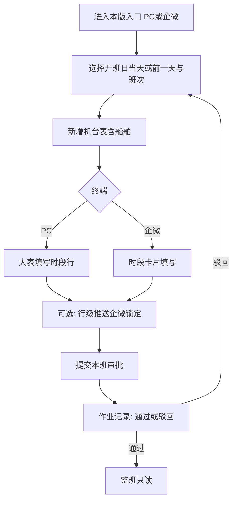

# 武港联投 · 单机作业量统计 — v1.1.0 产品需求文档（PRD）

| 项目 | 内容 |
|---|---|
| 版本号 | v1.1.0 |
| 版本更新日期 | 2026-10-08 |
| 版本定位 | 本版交付 **企微 H5 + 本版 PC**（工班 / 作业记录 / 停工）；与 v1.0.0 共用工班数据模型 |
| 终端形态 | PC 浏览器；企业微信内嵌 H5（原型带手机框预览） |
| 登录方式 | 统一平台登录 / 企微身份对接（原型不画登录页） |
| 关联版本 | 全量 PC（效率分析、船舶档案/船期/调度、系统配置、企微推送配置）见 [v1.0.0 PRD](../v1.0.0/prd.md) |
| 本版关键变更 | **开班日仅可选当天或前一天**（可补录昨天）；机台表 **必选船舶**；时段行可 **船舶覆盖**；含 **停工登记/记录** |

---

## 目录

- [一、结论摘要](#一结论摘要)
- [二、范围说明](#二范围说明)
- [三、核心业务规则](#三核心业务规则)
- [四、功能需求](#四功能需求)
- [五、用户交互路径](#五用户交互路径)
- [六、页面清单](#六页面清单)
- [七、数据与状态约定](#七数据与状态约定)
- [八、场景说明](#八场景说明)
- [九、风险项](#九风险项)
- [十、待确认](#十待确认)

---

## 一、结论摘要

v1.1.0 聚焦现场可闭环的 **工班填报 → 行级企微推送 → 本班审批 → 停工登记**。PC 用大表、企微用时段卡片，**同一数据模型**；开班日收窄为 **当天 + 前一天**，满足跨日补录夜班/昨班场景。

| 能力 | 结论 | 优先级 |
|---|---|---|
| 开班日范围 | 仅 **当天、前一天**；默认当天；创建机台表/列表筛选同口径 | P0 |
| 本版 PC 工班 | 开班日+班次下多张机台大表；必选船舶；行级编辑/推送/本班提交 | P0 |
| 企微 H5 填报 | 机台表 + **12 张时段卡片**（禁止大表）；编辑子页；行级推送；本班提交 | P0 |
| 作业记录 | PC 列表 + 企微卡片；审批中通过/驳回；草稿/驳回继续填报 | P0 |
| 停工 | PC 停工记录；企微停工登记（计时、满 1 小时群提醒）+ 停工记录 | P0 |
| 本班审批 | 班次级一次提交；白班/夜班各一次；与行级推送相互独立 | P0 |
| 效率分析 / 船舶调度全链路 / 推送选人配置 | **不在本版**，见 v1.0.0 | — |

---

## 二、范围说明

### 2.1 包含（本版）

| 范围 | 终端 | 优先级 |
|---|---|---|
| 工班作业（创建机台表、填报、推送、提交） | PC + 企微 | P0 |
| 作业记录（筛选、审批、继续填报/查看） | PC + 企微 | P0 |
| 停工登记 / 停工记录 | 企微登记+记录；PC 记录 | P0 |
| 开班日「当天或前一天」校验与控件限制 | PC + 企微 | P0 |
| 机台表必选船舶；时段船舶覆盖 | PC + 企微 | P0 |
| 原型：企微页手机框预览 | 企微 | P0 |

### 2.2 不包含（本版）

| 不包含项 | 说明 |
|---|---|
| 作业效率分析、作业总量、日班明细、智能问数 | 见 v1.0.0 |
| 船舶档案 / 船期 / 船舶调度 / 调度大屏 | 见 v1.0.0；本版创建机台表时 **引用** 船期/调度演示数据选船 |
| 系统配置（设备/泊位/货种/字典等） | 见 v1.0.0 |
| 企微推送「选人/群」配置页 | 见 v1.0.0；本版仅消费配置结果做推送示意 |
| 消息中心、审批中心、权限配置 | 平台能力；原型不画 |
| 独立原生 App | 企微为内嵌 H5 |

---

## 三、核心业务规则

| 规则项 | 说明 | 优先级 |
|---|---|---|
| 开班日 | 默认当天；可选范围 **仅当天、前一天**；超出不可创建机台表 | P0 |
| 班次 | 白班 08:00–20:00；夜班 20:00–次日 08:00；夜班归属开班日 | P0 |
| 机台表 | 开班日+班次下多张；创建时选齐泊位、机械、司机、货种、**船舶（必填）** | P0 |
| 唯一性 | 同开班日+班次下，**泊位+机械+司机+货种+船舶** 不可重复 | P0 |
| 时段 | 每机台表固定 12 时段；PC 大表行 / 企微卡片同一模型 | P0 |
| 船舶覆盖 | 机台表有默认船；单时段可覆盖为其他船；推送消息带船名 | P0 |
| 行级企微推送 | 单行发送后锁定，与审批无关；审批中/已通过时整班只读可查看 | P0 |
| 本班审批 | 草稿/已驳回可提交；至少一张机台表；白班、夜班各审批一次 | P0 |
| 非正常 | 须原因 + 时长（正整数，≤60 分钟）；原因「其他」须备注 | P0 |
| 删除机台表 | 含已推送行时不可删；泊位/机械创建后不可改 | P0 |

---

## 四、功能需求

### 4.1 本版 PC · 工班作业（P0）

| 维度 | 说明 |
|---|---|
| 本班上下文 | 选开班日（当天或前一天）、班次；展示班次状态与本班合计吨 |
| 新增机台表 | 弹窗选齐泊位/机械/司机/货种；从船期/调度（确报、靠泊、开工）搜索选船（必填） |
| 大表 | 时段行：作业量、是否正常、原因、非正常时长、备注；行内可改；行「编辑」可改司机/货种/船舶覆盖 |
| 推送 | 行「发送」推企微并锁定；消息含开班日、班次、泊位、机械、时段、司机、货种、船舶、作业量等 |
| 提交 | 「提交本班审批」；整班进入审批中 |

### 4.2 本版 PC · 作业记录（P0）

| 维度 | 说明 |
|---|---|
| 列表口径 | 开班日+班次一条；展示状态、机台表数、本班合计、更新时间 |
| 筛选 | 开班日（当天或前一天）、班次、状态 |
| 操作 | 审批中：通过/驳回；草稿/已驳回：继续填报；其他：查看 |

### 4.3 企微 H5 · 作业填报（P0）

| 维度 | 说明 |
|---|---|
| 本班上下文 | 同 PC：开班日（当天或前一天）、班次；新增机台表（含船舶） |
| 时段展示 | **卡片列表**（12 张/表），**禁止横向大表** |
| 卡片 | 直填作业量；底部编辑 / 发送；已推送只读并提示锁定 |
| 编辑子页 | 泊位/机械/时段只读；可改司机、货种、作业量、是否正常、原因、时长、备注、船舶覆盖；可「保存并推送企微」 |
| 本班提交 | 底栏提交本班审批；至少一张机台表 |

### 4.4 企微 H5 · 作业记录（P0）

| 维度 | 说明 |
|---|---|
| 展示 | 移动端卡片列表；与 PC 作业记录状态口径一致 |
| 筛选 | 开班日（当天或前一天）、班次、状态 |
| 操作 | 同 PC：通过/驳回、继续填报、查看 |

### 4.5 停工（P0）

| 维度 | PC | 企微 |
|---|---|---|
| 停工登记 | —（本版以记录台账为主） | 对开工船舶「开始停工」（必选原因并计时）/「结束停工」；满 1 小时推送企微群提醒 |
| 停工记录 | 列表台账：关联开工船舶、当日机台表、停工类型字典 | 已结束停工台账，按日查询 |

### 4.6 非功能与原型约定（P0/P1）

| 项 | 说明 | 优先级 |
|---|---|---|
| 企微预览 | 业务页须带 390×844 手机框；无底部业务 TabBar | P0 |
| 数据联调 | 原型 PC/企微同域 localStorage 共享 | P0 |
| 推送配置 | 正式环境由 v1.0.0 配置页维护；本版原型弹窗示意 | P1 |

---

## 五、用户交互路径

### 5.1 正常流程：工班填报与审批

文字解读：先定本班（仅今天/昨天），建机台表并填时段；推送可随时对单行执行且不改变班次状态；提交后整班审批，驳回可继续改。

### 5.2 正常流程：停工（企微）

1. 停工登记 → 查看开工船舶列表。  
2. 「开始停工」选原因 → 计时；满 1 小时触发群提醒（原型示意）。  
3. 「结束停工」结束本段 → 在停工记录中按日查阅。

### 5.3 边界情况

| 边界 | 行为 |
|---|---|
| 开班日选今天以外第二天及更早 | 控件不可选；创建机台表拦截并提示 |
| 补录昨天白班/夜班 | 允许；规则同当天 |
| 已推送行 | 不可再编辑；PC/企微同步只读 |
| 班次审批中/已通过 | 整班只读 |
| 机台表含已推送行 | 不可删除该机台表 |
| 本班无机台表即提交 | 拦截 |
| 非正常缺原因/时长或时长>60 | 拦截保存/发送 |
| 唯一键冲突 | 提示已存在，引导打开原表 |
| 创建未选船舶 | 拦截 |

### 5.4 异常兜底

| 异常 | 行为 |
|---|---|
| 企微推送失败（正式） | 行不锁定；提示重试（原型弹窗示意） |
| 停工推送失败 | 计时不中断；提示重试（原型示意） |
| 参数缺失进入时段子页 | 提示并退回 |
| 本地存储异常 | 提示刷新；正式环境走后端 |

---

## 六、页面清单

### 6.1 入口

| 页面 | 说明 | 优先级 |
|---|---|---|
| `prototype/versions/v1.1.0/index.html` | 企微 H5 版本入口 | P0 |
| `prototype/versions/v1.1.0/index-pc.html` | 本版 PC 入口 | P0 |

### 6.2 本版 PC

| 页面 | 说明 | 优先级 |
|---|---|---|
| `pages/work-stat-edit-pc.html` | 工班作业大表 | P0 |
| `pages/work-stat-records-pc.html` | 作业记录 | P0 |
| `pages/work-stat-stoppage-pc.html` | 停工记录 | P0 |

### 6.3 企微 H5

| 页面 | 说明 | 优先级 |
|---|---|---|
| `pages/work-stat-edit-wecom.html` | 作业填报 | P0 |
| `pages/work-stat-list-wecom.html` | 作业记录 | P0 |
| `pages/work-stat-line-wecom.html` | 时段编辑子页 | P0 |
| `pages/work-stat-view-wecom.html` | 班次详情只读 | P1 |
| `pages/work-stat-stoppage-wecom.html` | 停工登记 | P0 |
| `pages/work-stat-stoppage-list-wecom.html` | 停工记录 | P0 |

### 6.4 文档

| 文档 | 说明 |
|---|---|
| `docs/versions/v1.1.0/prd.md` | 本 PRD 源码（飞书/语雀粘贴以本文件为准） |
| `docs/versions/v1.1.0/prd.html` | 阅读页（加载本 md） |

---

## 七、数据与状态约定

| 约定项 | 说明 |
|---|---|
| 工班存储键（原型） | `tosWorkStatSheets_v6` / `tosWorkStatActive_v2`（与 v1.0.0 一致，双端共享） |
| 推送配置键 | `wecomPushConfig_v1`（v1.0.0 配置页维护） |
| 货种 | 一级→二级级联（演示数据） |
| 班次状态机 | 草稿 → 审批中 → 已通过 / 已驳回；驳回后可改再提 |
| 开班日合法区间 | `[今天-1日, 今天]` |
| 选船来源（原型） | 船期/调度演示：确报、靠泊、开工等状态可搜 |

---

## 八、场景说明

| 角色 | 典型动作 | 终端 |
|---|---|---|
| 现场录入员 | 补录昨天或填今天；建机台表；卡片/大表填报；行推送；提交本班 | 企微为主，PC 亦可 |
| 班组长/审批人 | 作业记录通过/驳回 | PC 或企微 |
| 现场调度协调 | 停工开始/结束、查看停工记录 | 企微；PC 查台账 |

---

## 九、风险项

| 风险 | 说明 | 缓解 |
|---|---|---|
| 开班日口径与 v1.0.0 不一致 | v1.0.0 仍为近 7 天；本版为 2 天 | 入口与 PRD 标明版本差异；发版时对齐后端校验 |
| 数据键共用 | 同域 localStorage 才一致 | 文档说明；正式环境后端统一 |
| 推送配置在 v1.0.0 | 现场无法改接收人 | 配置员在 PC 维护 |
| 双入口（PC/企微） | 用户找错版本页 | 总入口分栏；本版入口互链 |
| 中文路径本地预览 | `file://` 易失败 | 使用本地 HTTP 预览（`打开原型预览.bat`） |

---

## 十、待确认

| 项 | 说明 |
|---|---|
| 发版节奏 | v1.1.0 是否与 v1.0.0 同迭代发布 |
| 开班日是否需支持「仅前一天夜班、当天白班」等更细权限 | 当前按日期两天可选，不区分班次权限 |
| 停工满 1 小时提醒的接收群是否复用推送配置 | 原型示意；正式规则待定 |
| 企微是否需独立登录页原型 | 当前假设企微免登 / 平台对接 |
| PC 停工是否补「登记」页还是仅台账 | 当前原型 PC 为记录台账 |
